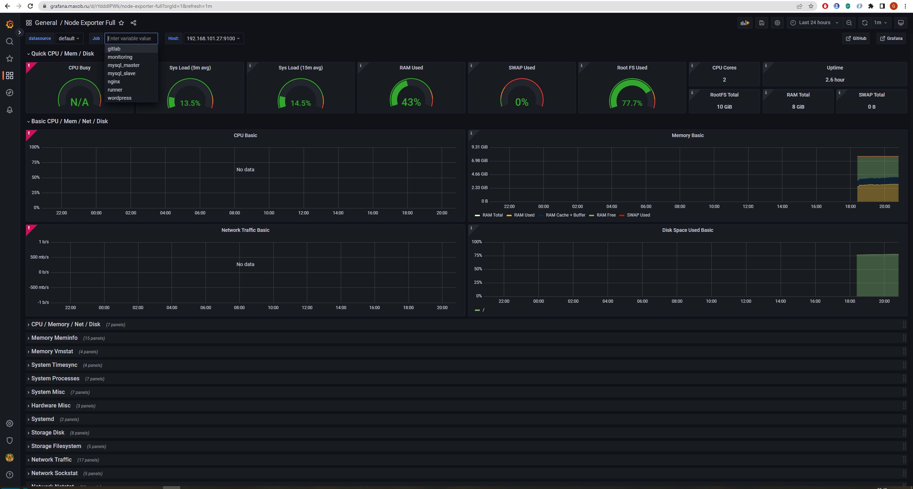

## Дипломное задание по курсу «DevOps-инженер»

### Результаты

1. Инфраструктура с рекомендуемыми характеристиками создана в YandexCloud при помощи Terraform:

2. Настроен nginx сервер как reverse proxy. Зарегистрирован домен `maxob.ru`, настроены A-записи на внешний адрес этого сервера:

Для зарегистрированных доменных имен получены LetsEncrypt сертификаты.

3. Настроен кластер баз данных MySQL. 2 ноды (`db01`, `db02`) работают в режиме репликации Master/Slave:

Создаваемые на master-ноде база данных `wordpress` и пользователь `wordpress` с полными правами на эту базу, успешно реплицируются на slave-ноду:

4. Установлен WordPress. В браузере можно увидеть главную страницу по https на зарегистрированном доменном имени:

5. Настроена CI/CD система для автоматического развертывания приложения при изменении кода. Интерфейс Gitlab доступен по https:

Построен pipeline доставки кода в среду эксплуатации. Содержимое `.gitlab-ci.yml`:

При коммите и создании тега происходит отправка на виртуальную машину с приложением (`app.maxob.ru`):

6. Настроена система мониторинга (Prometheus, Alert Manager, Node Exporter, Grafana) для получения метрик со всей инфраструктуры. Интерфейсы Prometheus, Alert Manager и Grafana доступны по https.  
На всех серверах установлен Node Exporter и его метрики доступны Prometheus:

У Alert Manager есть набор правил для создания алертов:

В случае недоступности серверов Alert Manager выдает предупреждение:

В Grafana есть дашборд, отображающий метрики из Node Exporter по всем серверам:

