# Курсовая работа по итогам модуля "DevOps и системное администрирование"

Курсовая работа необходима для проверки практических навыков, полученных в ходе прохождения курса "DevOps и системное администрирование".

Мы создадим и настроим виртуальное рабочее место. Позже вы сможете использовать эту систему для выполнения домашних заданий по курсу

## Выполнение

1. В фаерволе ufw (в Ubuntu предустановлен) разрешаем к нашей виртуальной машине сессии на порты 22 и 443 с помощью команд `sudo ufw allow 22` и `sudo ufw allow 443`.
Проверяем настройки ufw с помощью команды `sudo ufw status verbose`:

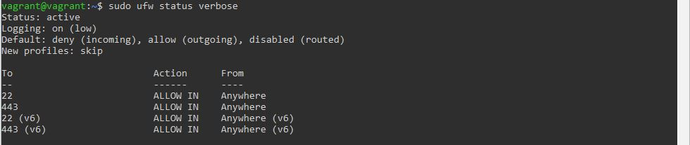

2. Устанавливаем hashicorp vault ([инструкция по ссылке](https://learn.hashicorp.com/tutorials/vault/getting-started-install?in=vault/getting-started#install-vault)).
С помощью команды `vault` выводим список общих команд хранилища:

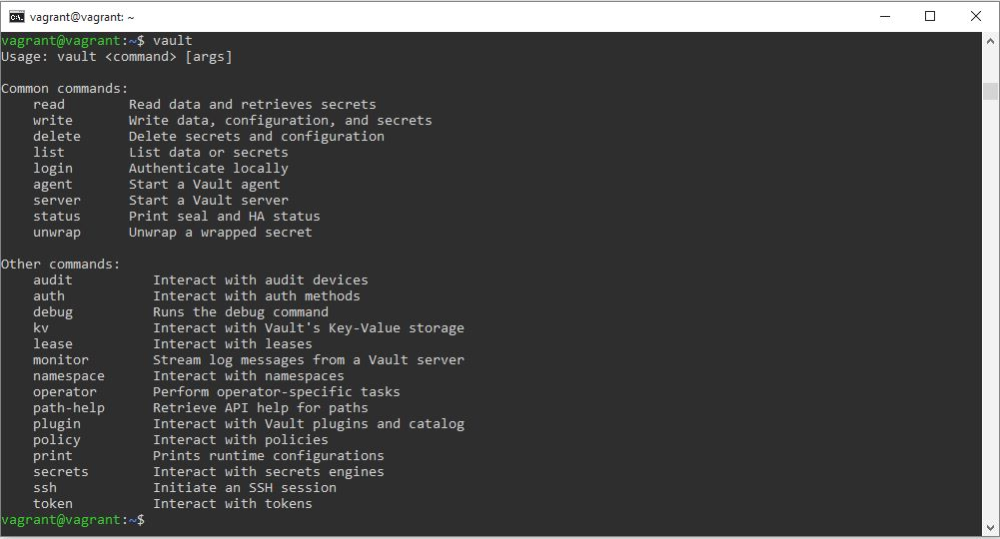

3. Создаем центр сертификации по инструкции ([ссылка](https://learn.hashicorp.com/tutorials/vault/pki-engine?in=vault/secrets-management)) и выпускаем сертификат для использования его в настройке веб-сервера nginx (срок жизни сертификата - месяц).

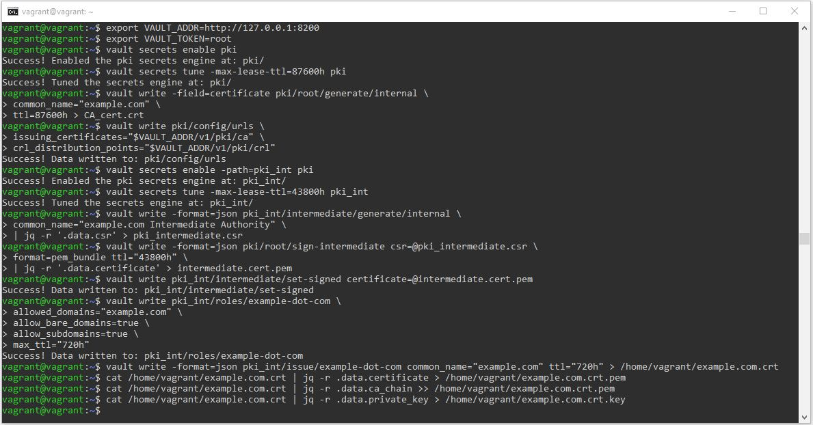

4. Устанавливаем корневой сертификат созданного центра сертификации в доверенные в хостовой системе. В моем случае это windows, устанавливаем через менеджер сертификатов (Пуск -> Выполнить -> certmgr.msc).
5. Устанавливаем nginx. Настраиваем автозапуск службы nginx при загрузке системы с помощью команды `sudo systemctl enable nginx`:

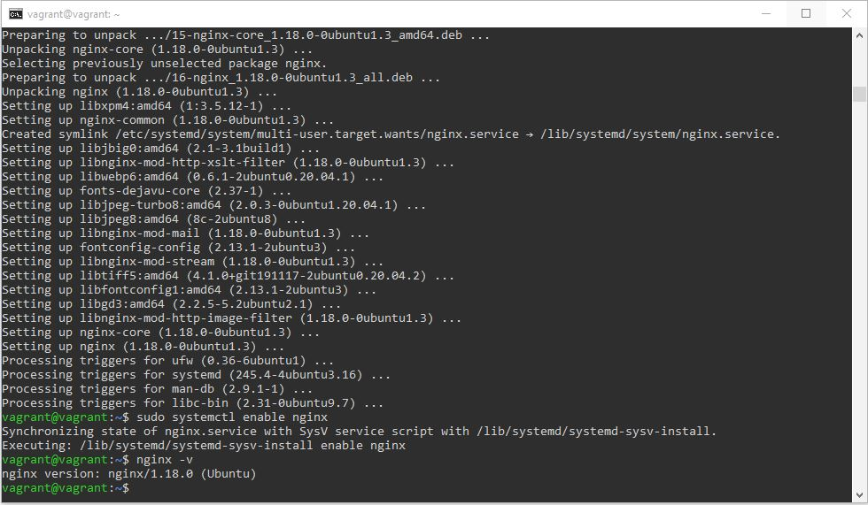

6. По инструкции ([ссылка](https://nginx.org/en/docs/http/configuring_https_servers.html)) настраиваем nginx на https, используя ранее подготовленный сертификат: в блок http добавляем блок server с указанным на скриншоте содержимым.
Для демонстрации работы сервера будем использовать стандартную стартовую страницу nginx.

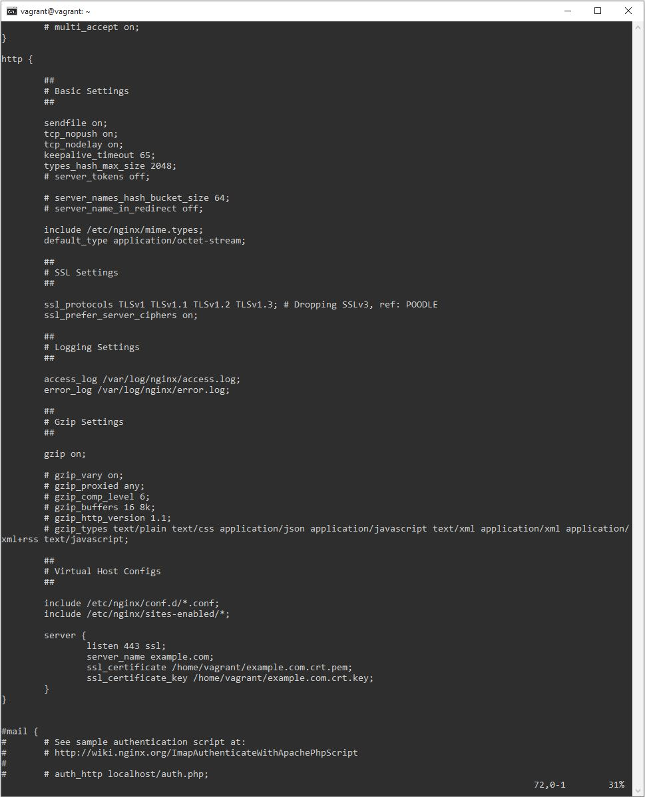

7. Открываем в браузере Google Chrome на хосте https адрес страницы, которую обслуживает сервер nginx. url страницы - example.com.
Значок замка в адресной строке браузера, а также корректное отображение стартовой страницы без предупреждений, говорят о том, что сертификат установлен успешно, подключение считается безопасным с действительным сертификатом. 

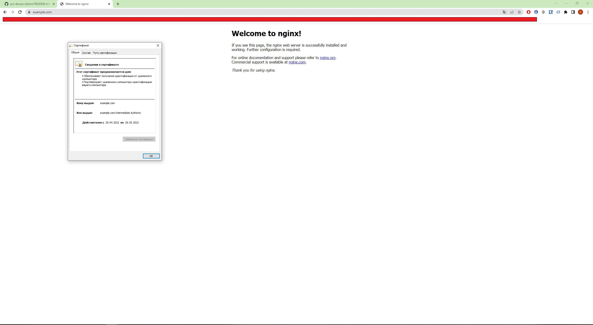

8. Создаем скрипт, который будет генерировать новый сертификат в vault:
  - генерируем новый сертификат так, чтобы не переписывать конфиг nginx (первые 4 строки кода);
  - перезапускаем nginx для применения нового сертификата (последняя строка).

Название файла - cert_script, помещаем его в директорию /usr/bin.

Второй скриншот демонстрирует, что при вызове `cert_script` генерируется новый сертификат, а также файлы .pem и .key (содержащие сертификаты и приватный ключ соответственно), используемые в нашей настройке сервера nginx.
После этого служба nginx перезапускается.

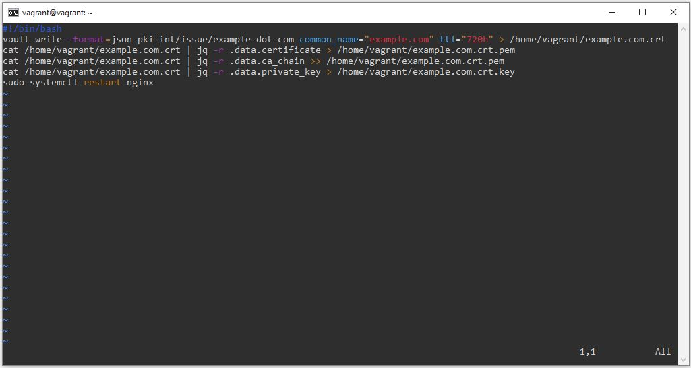

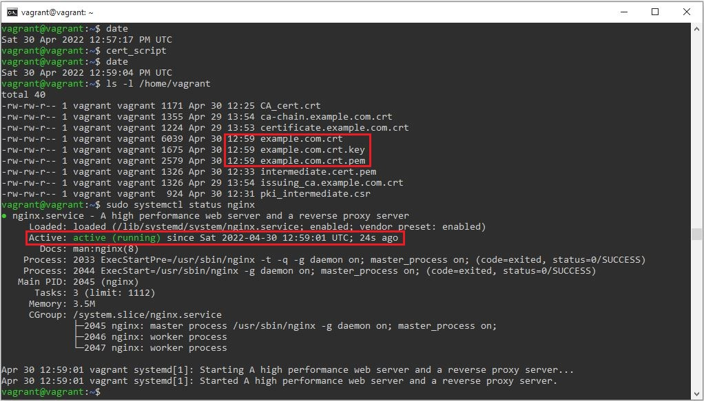

9. Помещаем скрипт в crontab, чтобы сертификат обновлялся какого-то числа каждого месяца в удобное для нас время. Для демонстрации работы устанавливаем запуск скрипта 30-го числа каждого месяца в 14:18 (второй скриншот, вывод команды `sudo crontab -l`).

Предварительно дорабатываем скрипт (первый скриншот): добавляем первые 2 строки (определение переменных), в последней строке убираем sudo.
В то же время, настраиваем crontab именно через sudo с помощью команды `sudo crontab -e`, чтобы обеспечить перезапуск службы nginx.

Второй скриншот демонстрирует, что в 14:18 30-го апреля скрипт успешно отработал - нужные файлы созданы, служба nginx перезапущена.

На третьем скриншоте приведена выдержка из системного лога (выполнен поиск по названию скрипта), отображающая успешный запуск нашего скрипта.  

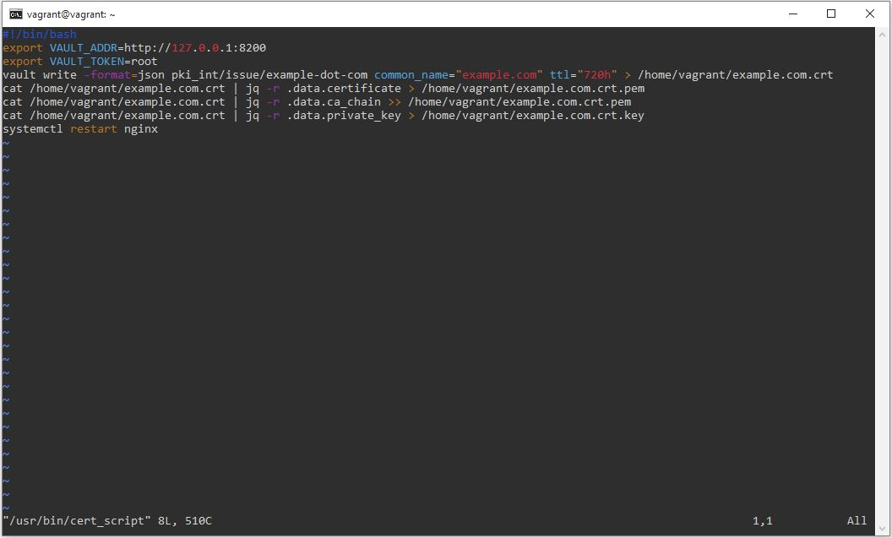

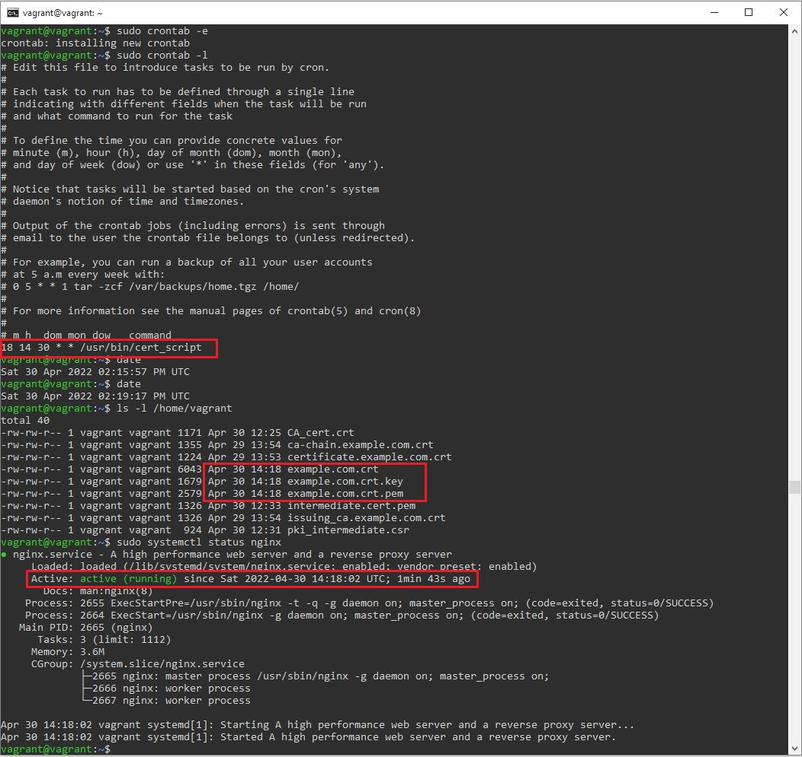

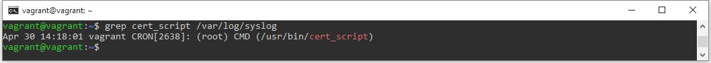
