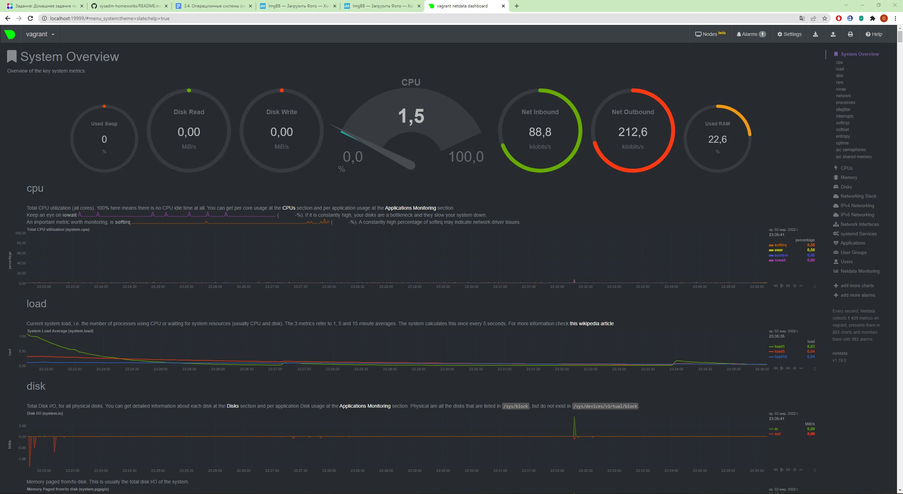
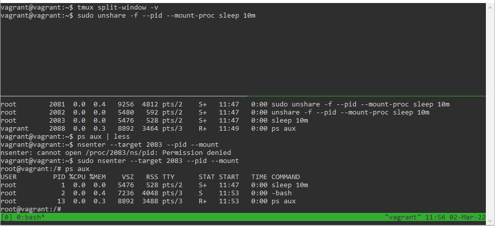

# Домашнее задание к занятию "3.4. Операционные системы. Лекция 2"

### Цель задания

В результате выполнения этого задания вы:
1. Познакомитесь со средством сбора метрик node_exporter и средством сбора и визуализации метрик NetData. Такого рода инструменты позволяют выстроить систему мониторинга сервисов для своевременного выявления проблем в их работе.
2. Построите простой systemd unit файл для создания долгоживущих процессов, которые стартуют вместе со стартом системы автоматически.
3. Проанализируете dmesg, а именно часть лога старта виртуальной машины, чтобы понять, какая полезная информация может там находиться.
4. Поработаете с unshare и nsenter для понимания, как создать отдельный namespace для процесса (частичная контейнеризация).

### Чеклист готовности к домашнему заданию

1. Убедитесь, что у вас установлен [Netdata](https://github.com/netdata/netdata) c ресурса с предподготовленными [пакетами](https://packagecloud.io/netdata/netdata/install) или `sudo apt install -y netdata`.


### Инструменты/ дополнительные материалы, которые пригодятся для выполнения задания

1. [Документация](https://www.freedesktop.org/software/systemd/man/systemd.service.html) по systemd unit файлам
2. [Документация](https://www.kernel.org/doc/Documentation/sysctl/) по параметрам sysctl

------

## Задание

1. На лекции мы познакомились с [node_exporter](https://github.com/prometheus/node_exporter/releases). В демонстрации его исполняемый файл запускался в background. Этого достаточно для демо, но не для настоящей production-системы, где процессы должны находиться под внешним управлением. Используя знания из лекции по systemd, создайте самостоятельно простой [unit-файл](https://www.freedesktop.org/software/systemd/man/systemd.service.html) для node_exporter:

    * поместите его в автозагрузку,
    * предусмотрите возможность добавления опций к запускаемому процессу через внешний файл (посмотрите, например, на `systemctl cat cron`),
    * удостоверьтесь, что с помощью systemctl процесс корректно стартует, завершается, а после перезагрузки автоматически поднимается.

### Ответ
После скачивания и распаковки архива node_exporter с github.com, копируем исполняемый файл node_exporter в директорию `/usr/local/bin`.  
Создаем пользователя `node_user` и назначаем владельца для исполняемого файла:
```
sudo useradd --no-create-home --shell /bin/false node_user
sudo chown -R node_user:node_user /usr/local/bin/node_exporter
```
В директории `/etc/systemd/system` создаем unit-файл `node_exporter.service` с содержимым:
```
[Unit]
Description=Node Exporter

[Service]
User=node_user
Group=node_user
Type=simple
EnvironmentFile=/etc/sysconfig/node_exporter/sysconfig.node_exporter
ExecStart=/usr/local/bin/node_exporter $OPTIONS

[Install]
WantedBy=multi-user.target
```
В директории `/etc/sysconfig/node_exporter` создаем файл `sysconfig.node_exporter` с нужными опциями, например: `OPTIONS="--collector.cpu.info"`.  
Перечитываем конфигурацию systemd, разрешаем автозапуск node_exporter, запускаем его, проверяем статус:
```
sudo systemctl daemon-reload
sudo systemctl enable node_exporter
sudo systemctl start node_exporter
sudo systemctl status node_exporter
```
После перезагрузки убеждаемся, что node_exporter работает, также с помощью команды: `sudo systemctl status node_exporter`, либо проверив логи, записанные с момента загрузки с помощью команды: `journalctl -b -u node_exporter`.

2. Ознакомьтесь с опциями node_exporter и выводом `/metrics` по-умолчанию. Приведите несколько опций, которые вы бы выбрали для базового мониторинга хоста по CPU, памяти, диску и сети.

### Ответ
Опции node_exporter для базового мониторинга хоста по CPU, памяти, диску, сети:
```
--collector.cpu
--collector.diskstats
--collector.meminfo
--collector.meminfo_numa
--collector.netclass
--collector.netdev
--collector.netstat
```

3. Установите в свою виртуальную машину [Netdata](https://github.com/netdata/netdata). Воспользуйтесь [готовыми пакетами](https://packagecloud.io/netdata/netdata/install) для установки (`sudo apt install -y netdata`). 
   
   После успешной установки:
    * в конфигурационном файле `/etc/netdata/netdata.conf` в секции [web] замените значение с localhost на `bind to = 0.0.0.0`,
    * добавьте в Vagrantfile проброс порта Netdata на свой локальный компьютер и сделайте `vagrant reload`:

    ```bash
    config.vm.network "forwarded_port", guest: 19999, host: 19999
    ```

    После успешной перезагрузки в браузере *на своем ПК* (не в виртуальной машине) вы должны суметь зайти на `localhost:19999`. Ознакомьтесь с метриками, которые по умолчанию собираются Netdata и с комментариями, которые даны к этим метрикам.

### Ответ
Netdata собирает большое количество метрик по CPU, дискам, памяти, сети, load average системы и т.д. 



4. Можно ли по выводу `dmesg` понять, осознает ли ОС, что загружена не на настоящем оборудовании, а на системе виртуализации?

### Ответ
Понять, что ОС загружена не на настоящем оборудовании, а на системе виртуализации, можно по следующим строкам в выводе команды `dmesg`: `DMI: innotek GmbH VirtualBox/VirtualBox, BIOS VirtualBox 12/01/2006`, `Hypervisor detected: KVM`.

5. Как настроен sysctl `fs.nr_open` на системе по-умолчанию? Определите, что означает этот параметр. Какой другой существующий лимит не позволит достичь такого числа (`ulimit --help`)?

### Ответ
Вывод команды `sysctl fs.nr_open` по умолчанию: `fs.nr_open = 1048576`.  
Этот параметр обозначает максимальное количество файловых дескрипторов, которые может выделить процесс (т.е. максимальное количество открытых файлов в одном процессе).  
Такого числа не позволит достичь лимит на максимальное количество открытых файловых дескрипторов, установленный по умолчанию: в выводе команды `ulimit -a` строка `open files (-n) 1024`.

6. Запустите любой долгоживущий процесс (не `ls`, который отработает мгновенно, а, например, `sleep 1h`) в отдельном неймспейсе процессов; покажите, что ваш процесс работает под PID 1 через `nsenter`. Для простоты работайте в данном задании под root (`sudo -i`). Под обычным пользователем требуются дополнительные опции (`--map-root-user`) и т.д.

### Ответ
Последовательность действий следующая.  
Выполняем `tmux split-window -v` для удобства отслеживания. Запускаем в первой панели долгоживущий процесс: `sudo unshare -f --pid --mount-proc sleep 10m`.  
Во второй панели узнаем PID запущенного процесса с помощью `ps aux` (в данном случае PID 2083).  
Заходим с хоста в этот неймспейс с помощью команды: `sudo nsenter --target 2083 --pid --mount`. Выполняем команду `ps aux` и видим, что у запущенного процесса PID 1.



7. Найдите информацию о том, что такое `:(){ :|:& };:`. Запустите эту команду в своей виртуальной машине Vagrant с Ubuntu 20.04 (**это важно, поведение в других ОС не проверялось**). Некоторое время все будет "плохо", после чего (минуты) – ОС должна стабилизироваться. Вызов `dmesg` расскажет, какой механизм помог автоматической стабилизации.  
Как настроен этот механизм по-умолчанию, и как изменить число процессов, которое можно создать в сессии?

*В качестве решения ответьте на вопросы и опишите каким образом эти ответы были получены*

### Ответ
`:(){ :|:& };:` - это fork-бомба, т.е. команда, бесконечно создающая свои копии системным вызовом fork(), которые также начинают создавать свои копии и т.д.  
В выводе `dmesg` видно, что стабилизировать систему удалось с помощью `pids controller`: `cgroup: fork rejected by pids controller in /user.slice/user-1000.slice/session-6.scope`.  
Чтобы использовать `pids controller` для изменения количества создаваемых процессов, можно установить максимальное количество задач в `pids.max` (указать необходимое число в `/sys/fs/cgroup/pids/parent/pids.max`).  
Кроме того, число процессов, которое можно создать в сессии, можно лимитировать с помощью команды `ulimit -u`.

----

### Правила приема домашнего задания

В личном кабинете отправлена ссылка на .md файл в вашем репозитории.

-----

### Критерии оценки

Зачет - выполнены все задания, ответы даны в развернутой форме, приложены соответствующие скриншоты и файлы проекта, в выполненных заданиях нет противоречий и нарушения логики.

На доработку - задание выполнено частично или не выполнено, в логике выполнения заданий есть противоречия, существенные недостатки. 