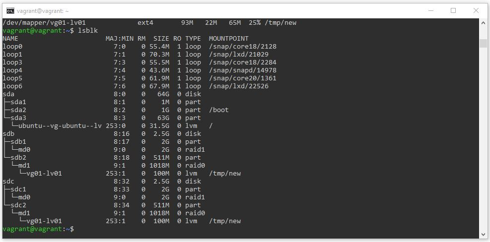
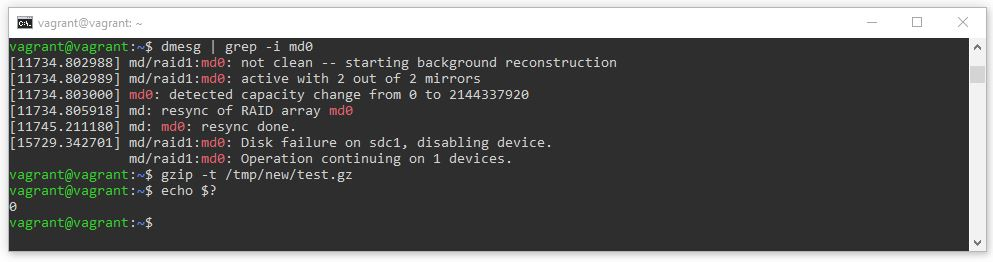

# Домашнее задание к занятию "3.5. Файловые системы"

### Цель задания

В результате выполнения этого задания вы: 

1. Научитесь работать с инструментами разметки жестких дисков, виртуальных разделов - RAID массивами и логическими томами, конфигурациями файловых систем. Основная задача - понять, какие слои абстракций могут нас отделять от файловой системы до железа. Обычно инженер инфраструктуры не сталкивается напрямую с настройкой LVM или RAID, но иметь понимание, как это работает - необходимо.
1. Создадите нештатную ситуацию работы жестких дисков и поймете, как система RAID обеспечивает отказоустойчивую работу.


### Чеклист готовности к домашнему заданию

1. Убедитесь, что у вас на новой виртуальной машине (шаг 3 задания) установлены следующие утилиты - `mdadm`, `fdisk`, `sfdisk`, `mkfs`, `lsblk`, `wget`.  
2. Воспользуйтесь пакетным менеджером apt для установки необходимых инструментов


### Инструменты/ дополнительные материалы, которые пригодятся для выполнения задания

1. Разряженные файлы - [sparse](https://ru.wikipedia.org/wiki/%D0%A0%D0%B0%D0%B7%D1%80%D0%B5%D0%B6%D1%91%D0%BD%D0%BD%D1%8B%D0%B9_%D1%84%D0%B0%D0%B9%D0%BB)
2. [Подробный анализ производительности RAID,3-19 страницы](https://www.baarf.dk/BAARF/0.Millsap1996.08.21-VLDB.pdf).
3. [RAID5 write hole](https://www.intel.com/content/www/us/en/support/articles/000057368/memory-and-storage.html).


------

## Задание

1. Узнайте о [sparse](https://ru.wikipedia.org/wiki/%D0%A0%D0%B0%D0%B7%D1%80%D0%B5%D0%B6%D1%91%D0%BD%D0%BD%D1%8B%D0%B9_%D1%84%D0%B0%D0%B9%D0%BB) (разряженных) файлах.

### Ответ
Разрежённый файл (sparse file) - файл, в котором последовательности нулевых байтов заменены на информацию об этих последовательностях (список дыр). Дыра (hole) - последовательность нулевых байт внутри файла, не записанная на диск. Информация о дырах (смещение от начала файла в байтах и количество байт) хранится в метаданных файловой системы.

2. Могут ли файлы, являющиеся жесткой ссылкой на один объект, иметь разные права доступа и владельца? Почему?

### Ответ
Файлы, являющиеся жесткой ссылкой на один объект, не могут иметь разные права доступа и владельца, т.к. у них одна и та же запись в таблице дескрипторов. Такая запись хранит атрибуты доступа, UID (идентификатор владельца файла) и GID (идентификатор группы владельца). Т.о. эти данные у таких файлов общие.

3. Сделайте `vagrant destroy` на имеющийся инстанс Ubuntu. Замените содержимое Vagrantfile следующим:

    ```ruby
    path_to_disk_folder = './disks'

    host_params = {
        'disk_size' => 2560,
        'disks'=>[1, 2],
        'cpus'=>2,
        'memory'=>2048,
        'hostname'=>'sysadm-fs',
        'vm_name'=>'sysadm-fs'
    }
    Vagrant.configure("2") do |config|
        config.vm.box = "bento/ubuntu-20.04"
        config.vm.hostname=host_params['hostname']
        config.vm.provider :virtualbox do |v|

            v.name=host_params['vm_name']
            v.cpus=host_params['cpus']
            v.memory=host_params['memory']

            host_params['disks'].each do |disk|
                file_to_disk=path_to_disk_folder+'/disk'+disk.to_s+'.vdi'
                unless File.exist?(file_to_disk)
                    v.customize ['createmedium', '--filename', file_to_disk, '--size', host_params['disk_size']]
                end
                v.customize ['storageattach', :id, '--storagectl', 'SATA Controller', '--port', disk.to_s, '--device', 0, '--type', 'hdd', '--medium', file_to_disk]
            end
        end
        config.vm.network "private_network", type: "dhcp"
    end
    ```

    Данная конфигурация создаст новую виртуальную машину с двумя дополнительными неразмеченными дисками по 2.5 Гб.

4. Используя `fdisk`, разбейте первый диск на 2 раздела: 2 Гб, оставшееся пространство.

### Ответ
Чтобы разбить первый дополнительный диск на 2 раздела, запускаем `fdisk` в интерактивном режиме, передав блочное устройство, которое надо разметить: `sudo fdisk /dev/sdb`. Создаем разделы с помощью команды `n`, сохраняем изменения с помощью команды `w`.

5. Используя `sfdisk`, перенесите данную таблицу разделов на второй диск.

### Ответ
Переносим получившуюся таблицу разделов на второй дополнительный диск: `sudo sfdisk -d /dev/sdb | sudo sfdisk /dev/sdc`.

6. Соберите `mdadm` RAID1 на паре разделов 2 Гб.

### Ответ
Создаем RAID1 на паре разделов 2 Гб: `sudo mdadm --create --verbose /dev/md0 --level=1 --raid-devices=2 /dev/sdb1 /dev/sdc1`.

7. Соберите `mdadm` RAID0 на второй паре маленьких разделов.

### Ответ
Создаем RAID0 на второй паре маленьких разделов: `sudo mdadm --create --verbose /dev/md1 --level=0 --raid-devices=2 /dev/sdb2 /dev/sdc2`.

8. Создайте 2 независимых PV на получившихся md-устройствах.

### Ответ
Создаем 2 Physical Volumes на получившихся md-устройствах: `sudo pvcreate /dev/md0 /dev/md1`.

9. Создайте общую volume-group на этих двух PV.

### Ответ
Создаем общую Volume Group на этих двух PV: `sudo vgcreate vg01 /dev/md0 /dev/md1`.

10. Создайте LV размером 100 Мб, указав его расположение на PV с RAID0.

### Ответ
Создаем Logical Volume размером 100 Мб, указав его расположение на PV с RAID0: `sudo lvcreate -L 100M -n lv01 vg01 /dev/md1`.

11. Создайте `mkfs.ext4` ФС на получившемся LV.

### Ответ
Создаем mkfs.ext4 файловую систему на получившемся LV: `sudo mkfs.ext4 /dev/vg01/lv01`.

12. Смонтируйте этот раздел в любую директорию, например, `/tmp/new`.

### Ответ
Монтируем этот раздел в директорию /tmp/new: `sudo mount /dev/vg01/lv01 /tmp/new`.

13. Поместите туда тестовый файл, например `wget https://mirror.yandex.ru/ubuntu/ls-lR.gz -O /tmp/new/test.gz`.

### Ответ
Поместим туда тестовый файл: `sudo wget https://mirror.yandex.ru/ubuntu/ls-lR.gz -O /tmp/new/test.gz`.

14. Прикрепите вывод `lsblk`.

### Ответ


15. Протестируйте целостность файла:

     ```bash
     root@vagrant:~# gzip -t /tmp/new/test.gz
     root@vagrant:~# echo $?
     0
     ```

16. Используя pvmove, переместите содержимое PV с RAID0 на RAID1.

### Ответ
Переместим содержимое PV с RAID0 на RAID1: `sudo pvmove /dev/md1 /dev/md0`.

17. Сделайте `--fail` на устройство в вашем RAID1 md.

### Ответ
Сделаем --fail на устройство в RAID1 md: `sudo mdadm --fail /dev/md0 /dev/sdc1`.

18. Подтвердите выводом `dmesg`, что RAID1 работает в деградированном состоянии.

### Ответ
Подтверждаем, что RAID1 работает в деградированном состоянии: `dmesg | grep -i md0`.

19. Протестируйте целостность файла, несмотря на "сбойный" диск он должен продолжать быть доступен:

     ```bash
     root@vagrant:~# gzip -t /tmp/new/test.gz
     root@vagrant:~# echo $?
     0
     ```

### Ответ
Проверяем пункты 18 и 19:


20. Погасите тестовый хост, `vagrant destroy`.
 
*В качестве решения ответьте на вопросы и опишите, каким образом эти ответы были получены*

----

### Правила приема домашнего задания

В личном кабинете отправлена ссылка на .md файл в вашем репозитории.


### Критерии оценки

Зачет - выполнены все задания, ответы даны в развернутой форме, приложены соответствующие скриншоты и файлы проекта, в выполненных заданиях нет противоречий и нарушения логики.

На доработку - задание выполнено частично или не выполнено, в логике выполнения заданий есть противоречия, существенные недостатки. 