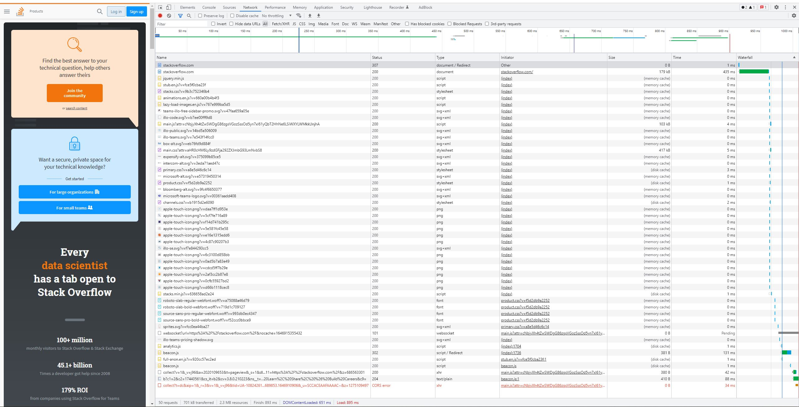

# Домашнее задание к занятию "3.6. Компьютерные сети. Лекция 1"

### Цель задания

В результате выполнения этого задания вы: 

1. Научитесь работать с http запросами, чтобы увидеть, как клиенты взаимодействуют с серверами по этому протоколу
2. Поработаете с сетевыми утилитами, чтобы разобраться, как их можно использовать для отладки сетевых запросов, соединений.

### Чеклист готовности к домашнему заданию

1. Убедитесь, что у вас установлены необходимые сетевые утилиты - dig, traceroute, mtr, telnet.
2. Используйте `apt install` для установки пакетов


### Инструкция к заданию

1. Создайте .md-файл для ответов на задания в своём репозитории, после выполнения, прикрепите ссылку на него в личном кабинете.
2. Любые вопросы по выполнению заданий спрашивайте в чате учебной группы и/или в разделе “Вопросы по заданию” в личном кабинете.


### Инструменты/ дополнительные материалы, которые пригодятся для выполнения задания

1. Полезным дополнением к обозначенным выше утилитам будет пакет net-tools. Установить его можно с помощью команды `apt install net-tools`.
2. RFC протокола HTTP/1.0, в частности [страница с кодами ответа](https://www.rfc-editor.org/rfc/rfc1945#page-32).
3. [Ссылки на остальные RFC для HTTP](https://blog.cloudflare.com/cloudflare-view-http3-usage/).

------

## Задание

1. Работа c HTTP через телнет.
- Подключитесь утилитой телнет к сайту stackoverflow.com
`telnet stackoverflow.com 80`
- Отправьте HTTP запрос
```bash
GET /questions HTTP/1.0
HOST: stackoverflow.com
[press enter]
[press enter]
```
*В ответе укажите полученный HTTP код, что он означает?*

### Ответ
При отправке указанного HTTP запроса получен HTTP код 301.
Код состояния HTTP 301 или Moved Permanently ("Перемещено навсегда") - стандартный код ответа HTTP, получаемый в ответ от сервера в ситуации, когда запрошенный ресурс был на постоянной основе перемещен в новое месторасположение.


2. Повторите задание 1 в браузере, используя консоль разработчика F12.
- откройте вкладку `Network`
- отправьте запрос http://stackoverflow.com
- найдите первый ответ HTTP сервера, откройте вкладку `Headers`
- укажите в ответе полученный HTTP код
- проверьте время загрузки страницы, какой запрос обрабатывался дольше всего?
- приложите скриншот консоли браузера в ответ.

### Ответ
При отправке запроса http://stackoverflow.com в браузере, во вкладке Network, в первом ответе HTTP сервера на вкладке Headers указан полученный HTTP код 307 Internal Redirect ("Внутреннее перенаправление").  
Время загрузки страницы - 893 мс. Дольше всего обрабатывался запрос beacon.js (https://sb.scorecardresearch.com/cs/17440561/beacon.js) - 131 мс.


3. Какой IP адрес у вас в интернете?

### Ответ
Мой IP: 92.255.132.178


4. Какому провайдеру принадлежит ваш IP адрес? Какой автономной системе AS? Воспользуйтесь утилитой `whois`

### Ответ
В выводе команды `whois 92.255.132.178`: провайдер - ER-Telecom, автономная система (AS) - AS12768.


5. Через какие сети проходит пакет, отправленный с вашего компьютера на адрес 8.8.8.8? Через какие AS? Воспользуйтесь утилитой `traceroute`

### Ответ
Пакет, отправленный на адрес 8.8.8.8, проходит через сети: Internet Assigned Numbers Authority (IANA), ER-Telecom (провайдер) и Google. Автономные системы: AS12768, AS15169. (вывод команды `traceroute -AnI 8.8.8.8`)


6. Повторите задание 5 в утилите `mtr`. На каком участке наибольшая задержка - delay?

### Ответ
В выводе `mtr -zn 8.8.8.8` видно, что наибольшая задержка на 74.125.253.94.


7. Какие DNS сервера отвечают за доменное имя dns.google? Какие A записи? Воспользуйтесь утилитой `dig`

### Ответ
За доменное имя dns.google (вывод `dig +trace dns.google`) отвечают DNS сервера: 
```
ns4.zdns.google.
ns3.zdns.google.
ns1.zdns.google.
ns2.zdns.google.
```
A записи:
```
8.8.8.8
8.8.4.4
```


8. Проверьте PTR записи для IP адресов из задания 7. Какое доменное имя привязано к IP? Воспользуйтесь утилитой `dig`

### Ответ
К полученным выше IP привязано доменное имя dns.google. (вывод `dig -x 8.8.8.8` и `dig -x 8.8.4.4`).


*В качестве ответов на вопросы приложите лог выполнения команд в консоли или скриншот полученных результатов.*

----

### Правила приема домашнего задания

В личном кабинете отправлена ссылка на .md файл в вашем репозитории.


### Критерии оценки

Зачет - выполнены все задания, ответы даны в развернутой форме, приложены соответствующие скриншоты и файлы проекта, в выполненных заданиях нет противоречий и нарушения логики.

На доработку - задание выполнено частично или не выполнено, в логике выполнения заданий есть противоречия, существенные недостатки. 
 
