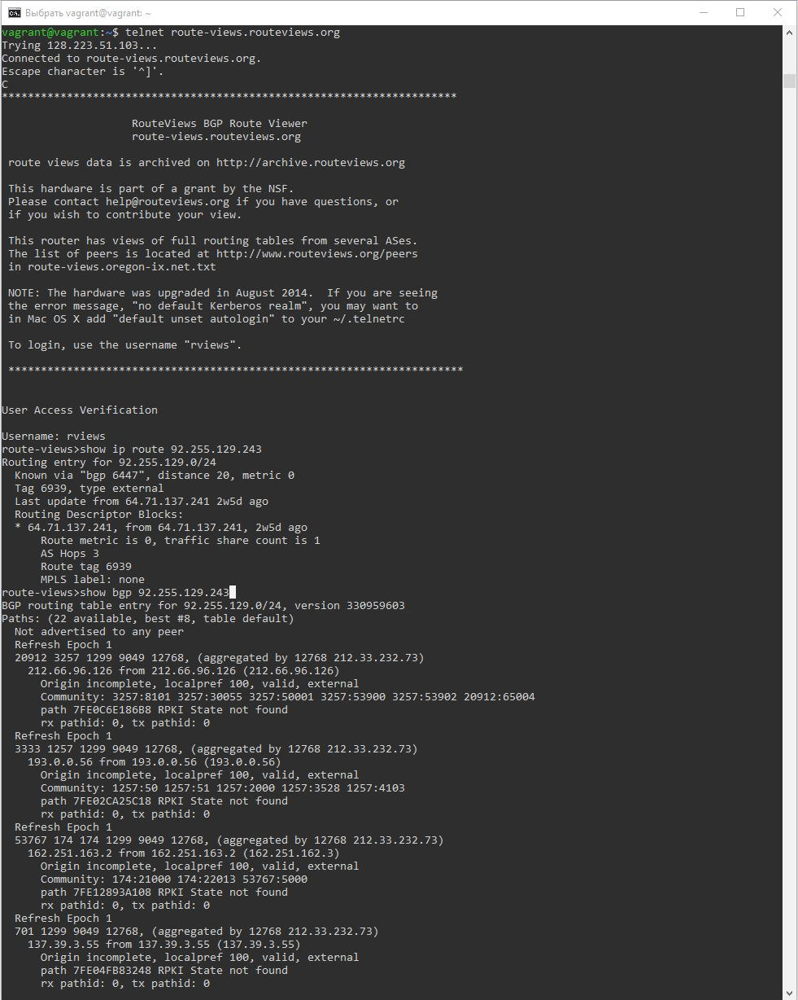
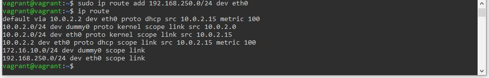
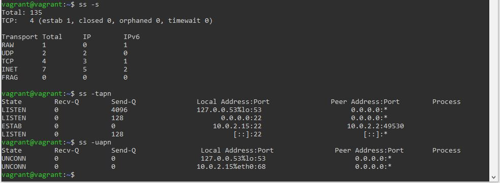
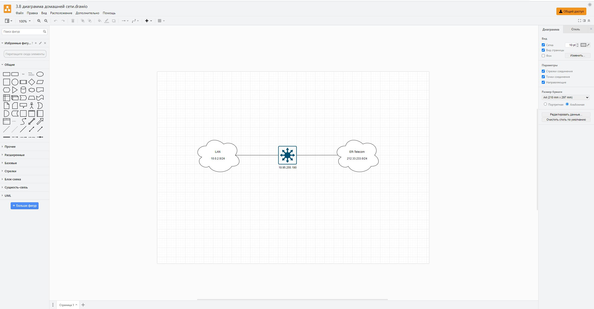

# Домашнее задание к занятию "3.8. Компьютерные сети, лекция 3"

### Цель задания

В результате выполнения этого задания вы:

1. На практике познакомитесь с маршрутизацией в сетях, что позволит понять устройство больших корпоративных сетей и интернета.
2. Проверите TCP/UDP соединения на хосте (это обычный этап отладки сетевых проблем).
3. Построите сетевую диаграмму.

### Чеклист готовности к домашнему заданию

1. Убедитесь, что у вас установлен `telnet`.
2. Воспользуйтесь пакетным менеджером apt для установки.


### Инструкция к заданию

1. Создайте .md-файл для ответов на задания в своём репозитории, после выполнения прикрепите ссылку на него в личном кабинете.
2. Любые вопросы по выполнению заданий спрашивайте в чате учебной группы и/или в разделе “Вопросы по заданию” в личном кабинете.


### Инструменты/ дополнительные материалы, которые пригодятся для выполнения задания

1. [Зачем нужны dummy интерфейсы](https://tldp.org/LDP/nag/node72.html)

------

## Задание

1. Подключитесь к публичному маршрутизатору в интернет. Найдите маршрут к вашему публичному IP
```
telnet route-views.routeviews.org
Username: rviews
show ip route x.x.x.x/32
show bgp x.x.x.x/32
```

### Ответ


2. Создайте dummy0 интерфейс в Ubuntu. Добавьте несколько статических маршрутов. Проверьте таблицу маршрутизации.

### Ответ
Создаем dummy0 интерфейс:  
создаем конфигурационный файл `02-dummy.yaml` в `/etc/netplan/` с содержимым:
```
network:
  version: 2
  renderer: networkd
  bridges:
    dummy0:
      dhcp4: no
      dhcp6: no
      accept-ra: no
      interfaces: [ ]
      addresses:
        - 10.0.2.0/24
```
затем выполняем `sudo netplan generate` и `sudo netplan apply`.  
Добавляем временные статические маршруты: `sudo ip route add 172.16.10.0/24 dev dummy0`, `sudo ip route add 192.168.250.0/24 dev eth0`.  
Проверяем таблицу маршрутизации с помощью `ip route`.


3. Проверьте открытые TCP порты в Ubuntu, какие протоколы и приложения используют эти порты? Приведите несколько примеров.

### Ответ
Вывод команды `ss -tapn` по TCP-сокетам дает информацию, что имеется одно установленное соединение через порт 22 (локальный адрес 10.0.2.15 с удаленным адресом 10.0.2.2, порт 49530), а также порт 53 (адрес 127.0.0.53, хост) в состоянии ожидания запроса на подключение.

4. Проверьте используемые UDP сокеты в Ubuntu, какие протоколы и приложения используют эти порты?

### Ответ
Вывод команды `ss -uapn` по UDP-сокетам дает информацию, что имеется два порта - 53 и 68, соединение по которым не установлено.  

Проверка `ss -tapn` и `ss -uapn`:


5. Используя diagrams.net, создайте L3 диаграмму вашей домашней сети или любой другой сети, с которой вы работали. 

### Ответ


*В качестве решения ответьте на вопросы, опишите, каким образом эти ответы были получены и приложите по неоходимости скриншоты*

 ---
 
## Задание для самостоятельной отработки* (необязательно к выполнению)

6. Установите Nginx, настройте в режиме балансировщика TCP или UDP.

7. Установите bird2, настройте динамический протокол маршрутизации RIP.

8. Установите Netbox, создайте несколько IP префиксов, используя curl проверьте работу API.

----

### Правила приема домашнего задания

В личном кабинете отправлена ссылка на .md файл в вашем репозитории.

-----

### Критерии оценки

Зачет - выполнены все задания, ответы даны в развернутой форме, приложены соответствующие скриншоты и файлы проекта, в выполненных заданиях нет противоречий и нарушения логики.

На доработку - задание выполнено частично или не выполнено, в логике выполнения заданий есть противоречия, существенные недостатки. 
 
Обязательными к выполнению являются задачи без указания звездочки. Их выполнение необходимо для получения зачета и диплома о профессиональной переподготовке.
Задачи со звездочкой (*) являются дополнительными задачами и/или задачами повышенной сложности. Они не являются обязательными к выполнению, но помогут вам глубже понять тему.