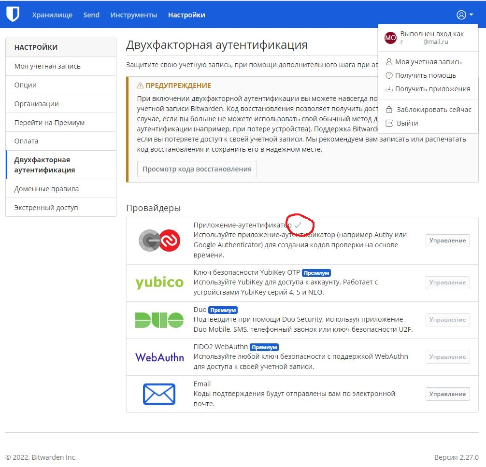

# Домашнее задание к занятию "3.9. Элементы безопасности информационных систем"


### Цель задания

В результате выполнения этого задания вы: 

1. Настроите парольный менеджер, что позволит не использовать один и тот же пароль на все ресурсы и удобно работать с множеством паролей.
2. Настроите веб-сервер на работу с https. Сегодня https является стандартом в интернете. Понимание сути работы центра сертификации, цепочки сертификатов позволит понять, на чем основывается https протокол.
3. Сконфигурируете ssh клиент на работу с разными серверами по-разному, что дает большую гибкость ssh соединений. Например, к некоторым серверам мы можем обращаться по ssh через приложения, где недоступен ввод пароля.
4. Поработаете со сбором и анализом трафика, которые необходимы для отладки сетевых проблем


### Инструкция к заданию

1. Создайте .md-файл для ответов на задания в своём репозитории, после выполнения прикрепите ссылку на него в личном кабинете.
2. Любые вопросы по выполнению заданий спрашивайте в чате учебной группы и/или в разделе “Вопросы по заданию” в личном кабинете.


### Инструменты/ дополнительные материалы, которые пригодятся для выполнения задания

1. [SSL + Apache2](https://digitalocean.com/community/tutorials/how-to-create-a-self-signed-ssl-certificate-for-apache-in-ubuntu-20-04)

------

## Задание

1. Установите Bitwarden плагин для браузера. Зарегестрируйтесь и сохраните несколько паролей.

### Ответ


2. Установите Google authenticator на мобильный телефон. Настройте вход в Bitwarden акаунт через Google authenticator OTP.

### Ответ


3. Установите apache2, сгенерируйте самоподписанный сертификат, настройте тестовый сайт для работы по HTTPS.

### Ответ
Устанавливаем apache2: `sudo apt install apache2`.  
Включаем `mod_ssl` - модуль Apache, обеспечивающий поддержку шифрования SSL, и перезапускаем Apache, чтобы активировать модуль: `sudo a2enmod ssl`, `sudo systemctl restart apache2`.  
Генерируем самоподписанный сертификат: `sudo openssl req -x509 -nodes -days 365 -newkey rsa:2048 -keyout /etc/ssl/private/apache-selfsigned.key -out /etc/ssl/certs/apache-selfsigned.crt -subj "/C=RU/ST=Perm/L=Perm/O=Company_Name/OU=Org/CN=www.example.com"`.  
Создаем файл конфигурации Apache: `sudo vim /etc/apache2/sites-available/your_domain_or_ip.conf`
```
<VirtualHost *:443>
   ServerName your_domain_or_ip
   DocumentRoot /var/www/your_domain_or_ip

   SSLEngine on
   SSLCertificateFile /etc/ssl/certs/apache-selfsigned.crt
   SSLCertificateKeyFile /etc/ssl/private/apache-selfsigned.key
</VirtualHost>
```
Cоздаем DocumentRoot и создаем в ней файл HTML для тестирования: `sudo mkdir /var/www/your_domain_or_ip`, `sudo vim /var/www/your_domain_or_ip/index.html`
```
<h1>it worked!</h1>
```
Включаем файл конфигурации с помощью команды a2ensite, проверяем ошибки конфигурации и перезагружаем Apache: `sudo a2ensite your_domain_or_ip.conf`, `sudo apache2ctl configtest`, `sudo systemctl reload apache2`.


4. Проверьте на TLS уязвимости произвольный сайт в интернете (кроме сайтов МВД, ФСБ, МинОбр, НацБанк, РосКосмос, РосАтом, РосНАНО и любых госкомпаний, объектов КИИ, ВПК ... и тому подобное).

### Ответ
testsl.sh - бесплатный многофункциональный инструмент командной строки с открытым исходным кодом, используемый для проверки служб с поддержкой шифрования TLS/SSL на наличие поддерживаемых шифров, протоколов и некоторых криптографических недостатков на серверах Linux/BSD.  
Устанавливаем и заходим в testsl.sh: `git clone --depth 1 https://github.com/drwetter/testssl.sh.git`, `cd testsl.sh`.  
Проверяем на TLS уязвимости сайт mail.ru: `./testssl.sh -U --sneaky https://mail.ru/`.


5. Установите на Ubuntu ssh сервер, сгенерируйте новый приватный ключ. Скопируйте свой публичный ключ на другой сервер. Подключитесь к серверу по SSH-ключу.

### Ответ
Устанавливаем ssh сервер: `sudo apt install openssh-server`, `sudo systemctl start sshd.service`, `sudo systemctl enable ssh`.  
Генерируем пару ключей ssh: `sudo ssh-keygen`.  
Копируем публичный ключ на удаленный сервер: `sudo ssh-copy-id vagrant@127.0.1.1`.  
Подключаемся к серверу по SSH-ключу: `ssh vagrant@127.0.1.1`.


6. Переименуйте файлы ключей из задания 5. Настройте файл конфигурации SSH клиента, так чтобы вход на удаленный сервер осуществлялся по имени сервера.

### Ответ
Переименовываем файлы сгенерированных ключей: `sudo mv ~/.ssh/id_rsa ~/.ssh/id_rsa_vagrant`, `sudo mv ~/.ssh/id_rsa.pub ~/.ssh/id_rsa_vagrant.pub`.  
Создаем пользовательский файл конфигурации SSH с определенными разрешениями и наполняем его содержимым: 
`touch ~/.ssh/config && chmod 600 ~/.ssh/config`,
`vi ~/.ssh/config`
```
Host vagrant1
HostName 127.0.1.1
IdentityFile ~/.ssh/id_rsa_vagrant
User vagrant
StrictHostKeyChecking no
Host *
User vagrant
IdentityFile ~/.ssh/id_rsa
Protocol 2
```
Заходим на удаленный сервер по имени сервера: `ssh vagrant1`.

7. Соберите дамп трафика утилитой tcpdump в формате pcap, 100 пакетов. Откройте файл pcap в Wireshark.

### Ответ
Собираем дамп трафика утилитой tcpdump в формате pcap, 100 пакетов, со всех интерфейсов с помощью команды: `sudo tcpdump -ni any -c 100 -w test.pcap`.    
Открываем файл pcap в Wireshark: `tshark -r test.pcap`.


*В качестве решения приложите: скриншоты, выполняемые команды, комментарии (по необходимости).*

 ---
 
## Задание для самостоятельной отработки* (необязательно к выполнению)

8. Просканируйте хост scanme.nmap.org. Какие сервисы запущены?

9. Установите и настройте фаервол ufw на web-сервер из задания 3. Откройте доступ снаружи только к портам 22,80,443

----

### Правила приема домашнего задания

В личном кабинете отправлена ссылка на .md файл в вашем репозитории.

-----

### Критерии оценки

Зачет - выполнены все задания, ответы даны в развернутой форме, приложены соответствующие скриншоты и файлы проекта, в выполненных заданиях нет противоречий и нарушения логики.

На доработку - задание выполнено частично или не выполнено, в логике выполнения заданий есть противоречия, существенные недостатки. 
 
Обязательными к выполнению являются задачи без указания звездочки. Их выполнение необходимо для получения зачета и диплома о профессиональной переподготовке.
Задачи со звездочкой (*) являются дополнительными задачами и/или задачами повышенной сложности. Они не являются обязательными к выполнению, но помогут вам глубже понять тему.