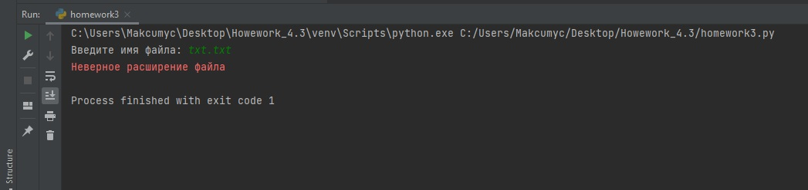
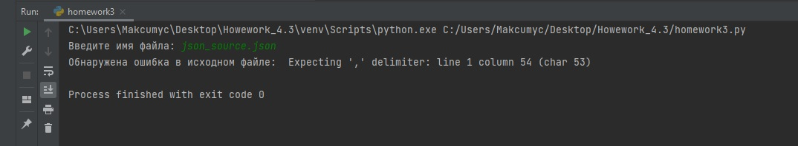
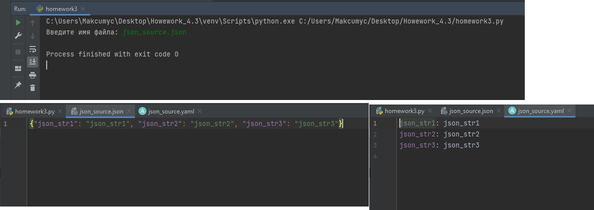
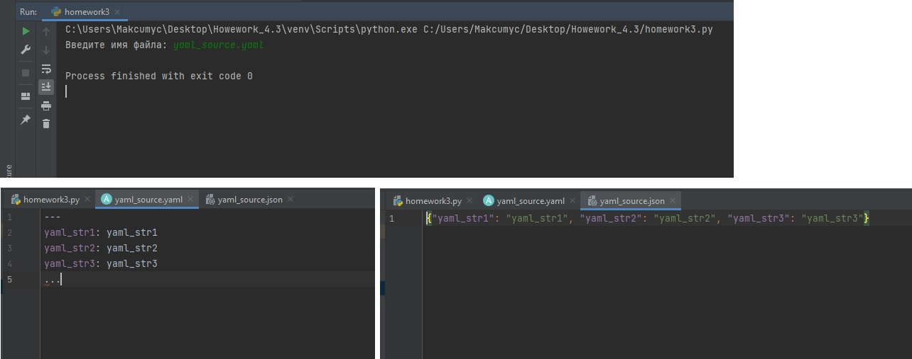

### Как сдавать задания

Вы уже изучили блок «Системы управления версиями», и начиная с этого занятия все ваши работы будут приниматься ссылками на .md-файлы, размещённые в вашем публичном репозитории.

Скопируйте в свой .md-файл содержимое этого файла; исходники можно посмотреть [здесь](https://raw.githubusercontent.com/netology-code/sysadm-homeworks/devsys10/04-script-03-yaml/README.md). Заполните недостающие части документа решением задач (заменяйте `???`, ОСТАЛЬНОЕ В ШАБЛОНЕ НЕ ТРОГАЙТЕ чтобы не сломать форматирование текста, подсветку синтаксиса и прочее, иначе можно отправиться на доработку) и отправляйте на проверку. Вместо логов можно вставить скриншоты по желани.

# Домашнее задание к занятию "4.3. Языки разметки JSON и YAML"


## Обязательная задача 1
Мы выгрузили JSON, который получили через API запрос к нашему сервису:
```
    { "info" : "Sample JSON output from our service\t",
        "elements" :[
            { "name" : "first",
            "type" : "server",
            "ip" : 7175 
            }
            { "name" : "second",
            "type" : "proxy",
            "ip : 71.78.22.43
            }
        ]
    }
```
  Нужно найти и исправить все ошибки, которые допускает наш сервис

### Исправленный вариант:
```
    { "info" : "Sample JSON output from our service\t",
        "elements" :[
            { "name" : "first",
            "type" : "server",
            "ip" : 7175 
            },
            { "name" : "second",
            "type" : "proxy",
            "ip" : "71.78.22.43"
            }
        ]
    }
```

## Обязательная задача 2
В прошлый рабочий день мы создавали скрипт, позволяющий опрашивать веб-сервисы и получать их IP. К уже реализованному функционалу нам нужно добавить возможность записи JSON и YAML файлов, описывающих наши сервисы. Формат записи JSON по одному сервису: `{ "имя сервиса" : "его IP"}`. Формат записи YAML по одному сервису: `- имя сервиса: его IP`. Если в момент исполнения скрипта меняется IP у сервиса - он должен так же поменяться в yml и json файле.

### Ваш скрипт:
```python
import json
import yaml
import socket

with open('iplist.json', 'r') as f:
    json_dict = json.load(f)

is_change = False
for URL in json_dict:
    ip = socket.gethostbyname(URL)
    if ip not in json_dict.values():
        print("[ERROR] " + URL + " IP mismatch: " + json_dict[URL] + " " + ip)
    json_dict[URL] = ip

print("IP веб-сервисов:",json_dict)

with open('iplist.json', 'w') as f:
    json.dump(json_dict, f)

with open('yaml_dict.yaml', 'w') as f:
    yaml.dump(json_dict, f)
```

### Вывод скрипта при запуске при тестировании:
```
[ERROR] mail.google.com IP mismatch: 173.194.221.17 209.85.233.18
IP веб-сервисов: {'drive.google.com': '64.233.162.194', 'mail.google.com': '209.85.233.18', 'google.com': '173.194.222.102'}
```

### json-файл(ы), который(е) записал ваш скрипт:
```json
{"drive.google.com": "64.233.162.194", "mail.google.com": "209.85.233.18", "google.com": "173.194.222.102"}
```

### yml-файл(ы), который(е) записал ваш скрипт:
```yaml
drive.google.com: 64.233.162.194
google.com: 173.194.222.102
mail.google.com: 209.85.233.18
```

## Дополнительное задание (со звездочкой*) - необязательно к выполнению

Так как команды в нашей компании никак не могут прийти к единому мнению о том, какой формат разметки данных использовать: JSON или YAML, нам нужно реализовать парсер из одного формата в другой. Он должен уметь:
   * Принимать на вход имя файла
   * Проверять формат исходного файла. Если файл не json или yml - скрипт должен остановить свою работу
   * Распознавать какой формат данных в файле. Считается, что файлы *.json и *.yml могут быть перепутаны
   * Перекодировать данные из исходного формата во второй доступный (из JSON в YAML, из YAML в JSON)
   * При обнаружении ошибки в исходном файле - указать в стандартном выводе строку с ошибкой синтаксиса и её номер
   * Полученный файл должен иметь имя исходного файла, разница в наименовании обеспечивается разницей расширения файлов

### Ваш скрипт:
```python
import os
import sys
import json
import yaml

file_source = input("Введите имя файла: ")

file_name, file_ext = os.path.splitext(file_source)
if file_ext not in ('.json', '.yaml'):
    sys.exit("Неверное расширение файла")

with open(file_source, "r") as f:
    beginning = f.read(1)

if beginning == '{':
    try:
        with open(file_source, "r") as f:
            json.load(f)
    except Exception as json_err:
        print("Обнаружена ошибка в исходном файле: ", json_err)
        if json_err != 0:
            sys.exit()
    with open(file_source, "r") as f:
        content = json.load(f)
    with open(file_name+'.yaml', 'w') as f:
        yaml.dump(content, f)
else:
    try:
        with open(file_source, "r") as f:
            yaml.safe_load(f)
    except Exception as yaml_err:
        print("Обнаружена ошибка в исходном файле: ", yaml_err)
        if yaml_err != 0:
            sys.exit()
    with open(file_source, "r") as f:
        content = yaml.safe_load(f)
    with open(file_name+'.json', 'w') as f:
        json.dump(content, f)
```

### Пример работы скрипта:
```
Проверка формата исходного файла:
```

```
Обнаружение ошибки в исходном json-файле:
```

```
JSON в YAML:
```

```
YAML в JSON:
```
