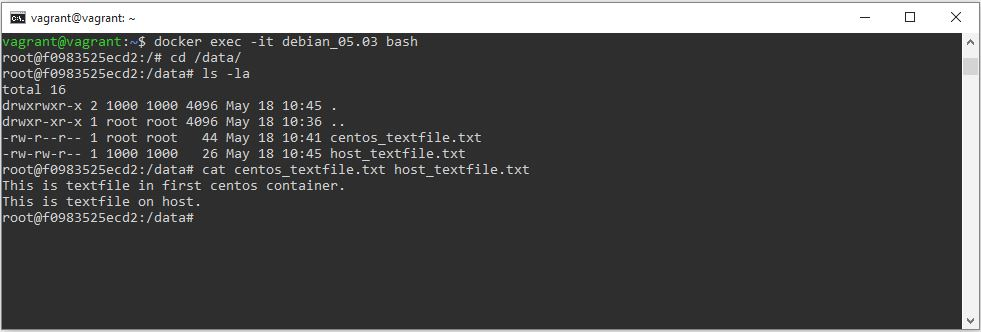

# Домашнее задание к занятию "5.3. Введение. Экосистема. Архитектура. Жизненный цикл Docker контейнера"

## Как сдавать задания

Обязательными к выполнению являются задачи без указания звездочки. Их выполнение необходимо для получения зачета и диплома о профессиональной переподготовке.

Задачи со звездочкой (*) являются дополнительными задачами и/или задачами повышенной сложности. Они не являются обязательными к выполнению, но помогут вам глубже понять тему.

Домашнее задание выполните в файле readme.md в github репозитории. В личном кабинете отправьте на проверку ссылку на .md-файл в вашем репозитории.

Любые вопросы по решению задач задавайте в чате Slack.

---

## Задача 1

Сценарий выполения задачи:

- создайте свой репозиторий на https://hub.docker.com;
- выберете любой образ, который содержит веб-сервер Nginx;
- создайте свой fork образа;
- реализуйте функциональность:
запуск веб-сервера в фоне с индекс-страницей, содержащей HTML-код ниже:
```
<html>
<head>
Hey, Netology
</head>
<body>
<h1>I’m DevOps Engineer!</h1>
</body>
</html>
```
Опубликуйте созданный форк в своем репозитории и предоставьте ответ в виде ссылки на https://hub.docker.com/username_repo.

### Ответ
Скачиваем официальную сборку nginx: `docker pull nginx`. Создаем директорию docker_nginx, в ней файл index.html,
в который копируем нужное содержимое. В этой же директории создаем Dockerfile с содержимым:  
```
FROM nginx:latest
COPY index.html /usr/share/nginx/html/index.html
EXPOSE 80
```  
Собираем Docker образ: `docker build -t oborinmaxim/nginx:05.03_1 .`. Публикуем образ в репозиторий на hub.docker.com:  
`docker login -u oborinmaxim`, `docker push oborinmaxim/nginx:05.03_1`. Ссылка на образ: https://hub.docker.com/r/oborinmaxim/nginx

## Задача 2

Посмотрите на сценарий ниже и ответьте на вопрос:
"Подходит ли в этом сценарии использование Docker контейнеров или лучше подойдет виртуальная машина, физическая машина? Может быть возможны разные варианты?"

Детально опишите и обоснуйте свой выбор.

--

Сценарий:

- Высоконагруженное монолитное java веб-приложение;
- Nodejs веб-приложение;
- Мобильное приложение c версиями для Android и iOS;
- Шина данных на базе Apache Kafka;
- Elasticsearch кластер для реализации логирования продуктивного веб-приложения - три ноды elasticsearch, два logstash и две ноды kibana;
- Мониторинг-стек на базе Prometheus и Grafana;
- MongoDB, как основное хранилище данных для java-приложения;
- Gitlab сервер для реализации CI/CD процессов и приватный (закрытый) Docker Registry.

### Ответ
- Высоконагруженное монолитное java веб-приложение;
- Nodejs веб-приложение;
- Мобильное приложение c версиями для Android и iOS;
- Elasticsearch кластер для реализации логирования продуктивного веб-приложения - три ноды elasticsearch, два logstash и две ноды kibana;
- Мониторинг-стек на базе Prometheus и Grafana;
- MongoDB, как основное хранилище данных для java-приложения;  
^ На мой взгляд, для данных сценариев использование Docker контейнеров подойдет, т.к. это более быстрый и менее ресурсозатратный способ создать изолированную среду для приложения с необходимыми библиотеками.  


- Шина данных на базе Apache Kafka;
- Gitlab сервер для реализации CI/CD процессов и приватный (закрытый) Docker Registry.  
^ В данных же случаях больше подойдет виртуальная машина, т.к. это более безопасный и отказоустойчивый вариант благодаря изоляции неисправностей и нарушений системы безопасности на аппаратном уровне. Контейнеры оборудование не виртуализируют.

## Задача 3

- Запустите первый контейнер из образа ***centos*** c любым тэгом в фоновом режиме, подключив папку ```/data``` из текущей рабочей директории на хостовой машине в ```/data``` контейнера;
- Запустите второй контейнер из образа ***debian*** в фоновом режиме, подключив папку ```/data``` из текущей рабочей директории на хостовой машине в ```/data``` контейнера;
- Подключитесь к первому контейнеру с помощью ```docker exec``` и создайте текстовый файл любого содержания в ```/data```;
- Добавьте еще один файл в папку ```/data``` на хостовой машине;
- Подключитесь во второй контейнер и отобразите листинг и содержание файлов в ```/data``` контейнера.

### Ответ
Скачиваем официальные сборки centos и debian: `docker pull centos`, `docker pull debian`.
Запускаем контейнеры, подключив директорию /data из текущей рабочей директории на хостовой машине в /data контейнера;
дополнительно указываем какую-либо команду, чтобы поддерживать их в работающем состоянии:
`docker run -v /home/vagrant/data:/data --name centos_05.03 -d centos ping -i 30 127.0.0.1`,  
`docker run -v /home/vagrant/data:/data --name debian_05.03 -d debian sleep 15m`.  
Подключаемся к первому контейнеру: `docker exec -it centos_05.03 bash`, создаем в директории /data текстовый файл
entos_textfile.txt с содержимым: `"This is textfile in first centos container."`.  
Создаем на хостовой машине в директории /home/vagrant/data текстовый файл host_textfile.txt с содержимым: `"This is textfile on host."`.  
Подключаемся ко второму контейнеру и проверяем содержимое директории /data: `docker exec -it debian_05.03 bash`



## Задача 4 (*)

Воспроизвести практическую часть лекции самостоятельно.

Соберите Docker образ с Ansible, загрузите на Docker Hub и пришлите ссылку вместе с остальными ответами к задачам.

### Ответ
Ссылка на образ: https://hub.docker.com/r/oborinmaxim/ansible

---

### Как cдавать задание

Выполненное домашнее задание пришлите ссылкой на .md-файл в вашем репозитории.

---