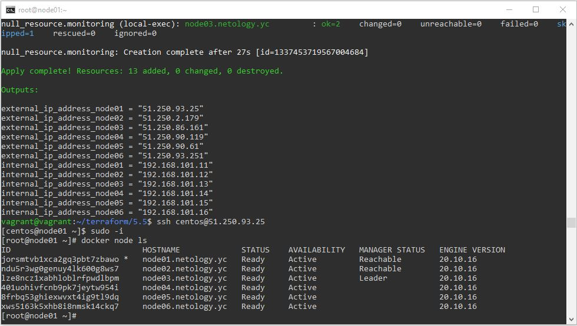
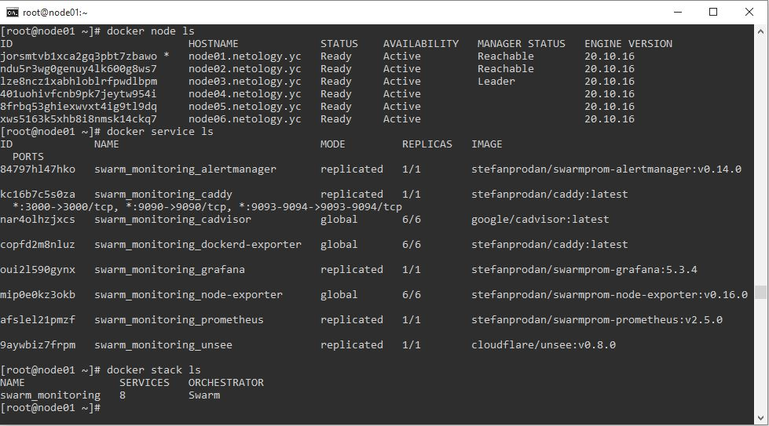
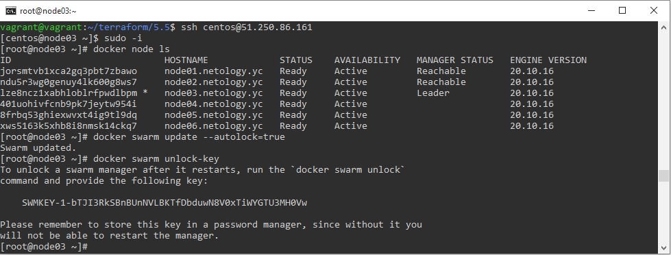

# Домашнее задание к занятию "5.5. Оркестрация кластером Docker контейнеров на примере Docker Swarm"

## Задача 1

Дайте письменые ответы на следующие вопросы:

- В чём отличие режимов работы сервисов в Docker Swarm кластере: replication и global?
- Какой алгоритм выбора лидера используется в Docker Swarm кластере?
- Что такое Overlay Network?

### Ответ
1) При режиме replication создается указанное количество реплик на соответствующем количестве рабочих нод, тогда как при режиме global создается по одному экземпляру на каждой ноде.  
2) Для выбора лидера используется алгоритм Raft. При выходе лидера из строя автоматически назначается новый из доступных управляющих нод (менеджеров).
3) Overlay Network, или оверлейная сеть - это сеть (чаще всего виртуальная), построенная поверх другой сети. Например,  VPN или сети, создаваемые между виртуальными машинами.

## Задача 2

Создать ваш первый Docker Swarm кластер в Яндекс.Облаке

Для получения зачета, вам необходимо предоставить скриншот из терминала (консоли), с выводом команды:
```
docker node ls
```
### Скриншот


## Задача 3

Создать ваш первый, готовый к боевой эксплуатации кластер мониторинга, состоящий из стека микросервисов.

Для получения зачета, вам необходимо предоставить скриншот из терминала (консоли), с выводом команды:
```
docker service ls
```
### Скриншот


## Задача 4 (*)

Выполнить на лидере Docker Swarm кластера команду (указанную ниже) и дать письменное описание её функционала, что она делает и зачем она нужна:
```
# см.документацию: https://docs.docker.com/engine/swarm/swarm_manager_locking/
docker swarm update --autolock=true
```
### Ответ
`docker swarm update` обновляет swarm новыми значениями параметров - в данном случае включает автоблокировку.  
Чтобы защитить общий ключ шифрования TLS и ключ, используемый для шифрования и расшифровки журналов Raft, Docker делает нас владельцем этих ключей и позволяет требовать ручной разблокировки управляющих. Когда Docker перезапустится, сначала нужно будет разблокировать swarm, используя сгенерированный при блокировке ключ шифрования.



---

### Как cдавать задание

Выполненное домашнее задание пришлите ссылкой на .md-файл в вашем репозитории.

---