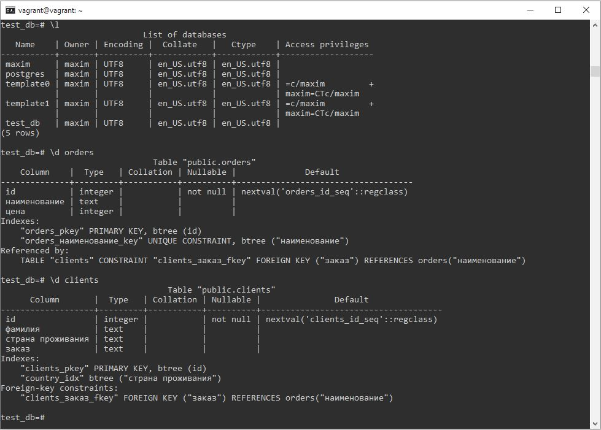
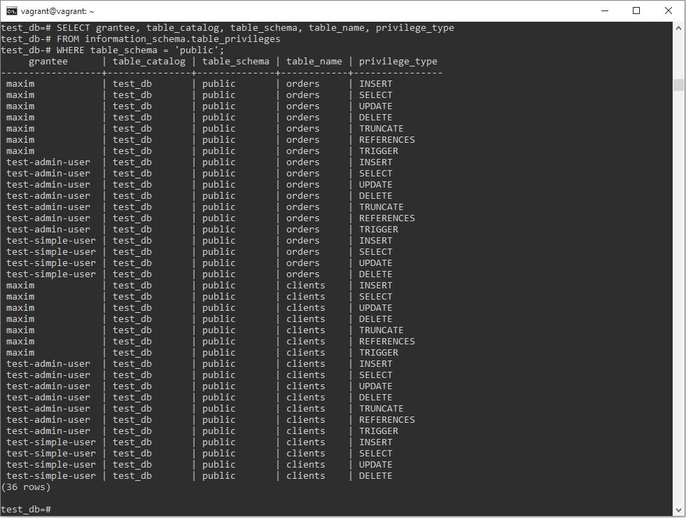
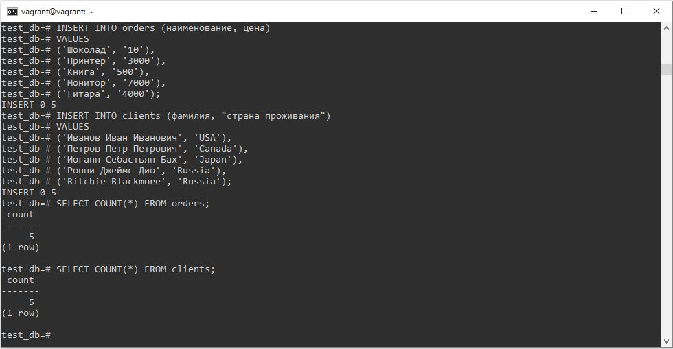
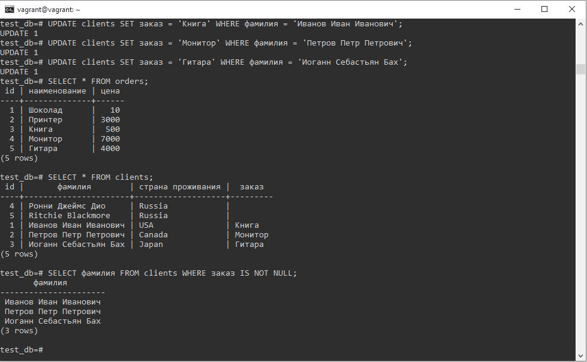
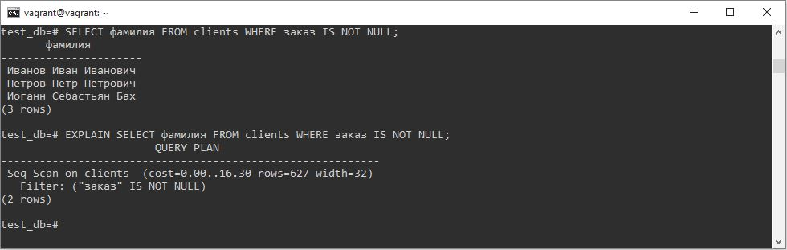

# Домашнее задание к занятию "6.2. SQL"

## Введение

Перед выполнением задания вы можете ознакомиться с 
[дополнительными материалами](https://github.com/netology-code/virt-homeworks/tree/master/additional/README.md).

## Задача 1

Используя docker поднимите инстанс PostgreSQL (версию 12) c 2 volume, 
в который будут складываться данные БД и бэкапы.

Приведите получившуюся команду или docker-compose манифест.

### Ответ
Команда для запуска:
`docker run -d --name 6.2_postgres -e POSTGRES_USER=maxim -e POSTGRES_PASSWORD=netology -v data_volume:/data -v backup_volume:/backup postgres:12`

## Задача 2

В БД из задачи 1: 
- создайте пользователя test-admin-user и БД test_db
- в БД test_db создайте таблицу orders и clients (спeцификация таблиц ниже)
- предоставьте привилегии на все операции пользователю test-admin-user на таблицы БД test_db
- создайте пользователя test-simple-user  
- предоставьте пользователю test-simple-user права на SELECT/INSERT/UPDATE/DELETE данных таблиц БД test_db

Таблица orders:
- id (serial primary key)
- наименование (string)
- цена (integer)

Таблица clients:
- id (serial primary key)
- фамилия (string)
- страна проживания (string, index)
- заказ (foreign key orders)

Приведите:
- итоговый список БД после выполнения пунктов выше,
- описание таблиц (describe)
- SQL-запрос для выдачи списка пользователей с правами над таблицами test_db
- список пользователей с правами над таблицами test_db

### Ответ
Подключаемся к PostgreSQL в изолированной среде с помощью утилиты psql:
`psql -h 172.17.0.2 -U maxim`.  
Создаем пользователя test-admin-user и БД test_db:
`CREATE USER "test-admin-user";`,
`CREATE DATABASE test_db;`.  
Переходим в БД test_db, создаем таблицы и добавляем индекс для столбца "страна проживания" таблицы "clients" (согласно условию задачи):  
`\c test_db`,
`CREATE TABLE orders (id SERIAL PRIMARY KEY, наименование TEXT UNIQUE, цена INT);`,  
`CREATE TABLE clients (id SERIAL PRIMARY KEY, фамилия TEXT, "страна проживания" TEXT, заказ TEXT REFERENCES orders (наименование));`,  
`CREATE INDEX country_idx ON clients ("страна проживания");`.  
Предоставляем привилегии на все операции пользователю test-admin-user на таблицы БД test_db:  
`GRANT ALL PRIVILEGES ON ALL TABLES IN SCHEMA public TO "test-admin-user";`.  
Создаем пользователя test-simple-user и предоставляем ему права на SELECT/INSERT/UPDATE/DELETE данных таблиц БД test_db:  
`CREATE USER "test-simple-user";`,
`GRANT SELECT, INSERT, UPDATE, DELETE ON ALL TABLES IN SCHEMA public TO "test-simple-user";`.  

Получаем:  
итоговый список БД после выполнения пунктов выше - с помощью команды `\l`, описание таблиц (describe) - с помощью команд `\d orders` и `\d clients`

SQL-запрос для выдачи списка пользователей с правами над таблицами test_db: 
`SELECT grantee, table_catalog, table_schema, table_name, privilege_type FROM information_schema.table_privileges WHERE table_schema = 'public';`

## Задача 3

Используя SQL синтаксис - наполните таблицы следующими тестовыми данными:

Таблица orders

|Наименование|цена|
|------------|----|
|Шоколад| 10 |
|Принтер| 3000 |
|Книга| 500 |
|Монитор| 7000|
|Гитара| 4000|

Таблица clients

|ФИО|Страна проживания|
|------------|----|
|Иванов Иван Иванович| USA |
|Петров Петр Петрович| Canada |
|Иоганн Себастьян Бах| Japan |
|Ронни Джеймс Дио| Russia|
|Ritchie Blackmore| Russia|

Используя SQL синтаксис:
- вычислите количество записей для каждой таблицы 
- приведите в ответе:
    - запросы 
    - результаты их выполнения.

### Ответ
Используя SQL синтаксис, наполняем таблицы данными. Таблица orders:
`INSERT INTO orders (наименование, цена)
VALUES
('Шоколад', '10'),
('Принтер', '3000'),
('Книга', '500'),
('Монитор', '7000'),
('Гитара', '4000');`.  
Таблица clients:
`INSERT INTO clients (фамилия, "страна проживания")
VALUES
('Иванов Иван Иванович', 'USA'),
('Петров Петр Петрович', 'Canada'),
('Иоганн Себастьян Бах', 'Japan'),
('Ронни Джеймс Дио', 'Russia'),
('Ritchie Blackmore', 'Russia');`.

Используя SQL синтаксис, вычисляем количество записей для каждой таблицы:
`SELECT COUNT(*) FROM orders;`,
`SELECT COUNT(*) FROM clients;`.

## Задача 4

Часть пользователей из таблицы clients решили оформить заказы из таблицы orders.

Используя foreign keys свяжите записи из таблиц, согласно таблице:

|ФИО|Заказ|
|------------|----|
|Иванов Иван Иванович| Книга |
|Петров Петр Петрович| Монитор |
|Иоганн Себастьян Бах| Гитара |

Приведите SQL-запросы для выполнения данных операций.

Приведите SQL-запрос для выдачи всех пользователей, которые совершили заказ, а также вывод данного запроса.
 
Подсказк - используйте директиву `UPDATE`.

### Ответ
Связываем записи из таблиц:
`UPDATE clients SET заказ = 'Книга' WHERE фамилия = 'Иванов Иван Иванович';`,  
`UPDATE clients SET заказ = 'Монитор' WHERE фамилия = 'Петров Петр Петрович';`,  
`UPDATE clients SET заказ = 'Гитара' WHERE фамилия = 'Иоганн Себастьян Бах';`.  
SQL-запрос для выдачи всех пользователей, которые совершили заказ:
`SELECT фамилия FROM clients WHERE заказ IS NOT NULL;`

## Задача 5

Получите полную информацию по выполнению запроса выдачи всех пользователей из задачи 4 
(используя директиву EXPLAIN).

Приведите получившийся результат и объясните что значат полученные значения.

### Ответ
При выполнении `EXPLAIN SELECT фамилия FROM clients WHERE заказ IS NOT NULL;` выдается план запроса.

**Первая строка.** Последовательное сканирование (Seq Scan) будет выполнено по таблице clients. Числа, перечисленные в скобках (слева направо), имеют следующий смысл:
 - Приблизительная стоимость запуска. Это время, которое проходит, прежде чем начнётся этап вывода данных, например для сортирующего узла это время сортировки.
 - Приблизительная общая стоимость. Она вычисляется в предположении, что узел плана выполняется до конца, то есть возвращает все доступные строки, плюс отражая дополнительное время, которое потребуется процессору на проверку условия WHERE.
 - Ожидаемое число строк, которое должен вывести этот узел плана. При этом так же предполагается, что узел выполняется до конца.
 - Ожидаемый средний размер строк, выводимых этим узлом плана (в байтах).

**Вторая строка.** Условие WHERE (в нашем случае "заказ IS NOT NULL") применено как «фильтр» к узлу плана Seq Scan. Это означает, что узел плана проверяет это условие для каждого просканированного им узла и выводит только те строки, которые удовлетворяют ему.

## Задача 6

Создайте бэкап БД test_db и поместите его в volume, предназначенный для бэкапов (см. Задачу 1).

Остановите контейнер с PostgreSQL (но не удаляйте volumes).

Поднимите новый пустой контейнер с PostgreSQL.

Восстановите БД test_db в новом контейнере.

Приведите список операций, который вы применяли для бэкапа данных и восстановления. 

### Ответ
Подключаемся к контейнеру, создаем бэкап БД test_db и помещаем его в volume, предназначенный для бэкапов:  
`docker exec -it 6.2_postgres bash`,  
`pg_dump -U maxim test_db > /backup/backup.sql`.  
Останавливаем контейнер с PostgreSQL (не удаляя volumes), поднимаем новый пустой контейнер с PostgreSQL:  
`docker stop 6.2_postgres`,  
`docker run -d --name 6.2_postgres_2 -e POSTGRES_USER=maxim -e POSTGRES_PASSWORD=netology -v data_volume:/data -v backup_volume:/backup postgres:12`.  
Подключаемся к PostgreSQL в новом контейнере, создаем пустую БД с названием test_db, выходим, после чего подключаемся к самому контейнеру и восстанавливаем в нем БД из volume:  
`psql -h 172.17.0.2 -U maxim`,  
`CREATE DATABASE test_db;`,  
`docker exec -it 6.2_postgres_2 bash`,  
`psql -U maxim test_db < /backup/backup.sql`.

---

### Как cдавать задание

Выполненное домашнее задание пришлите ссылкой на .md-файл в вашем репозитории.

---