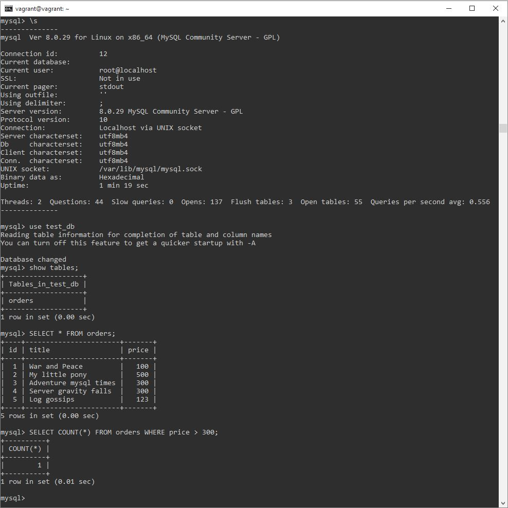
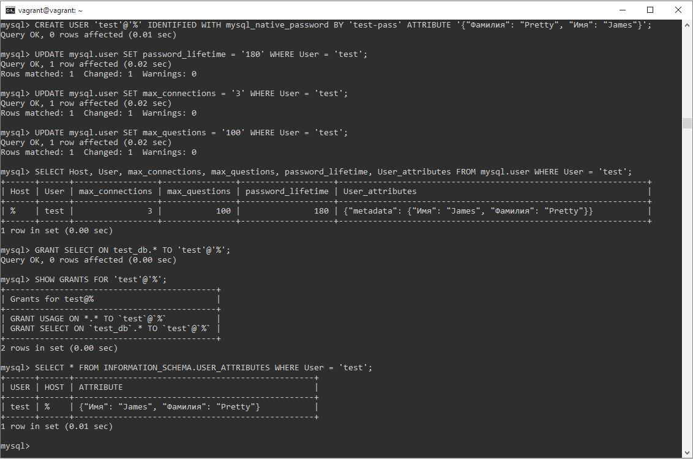
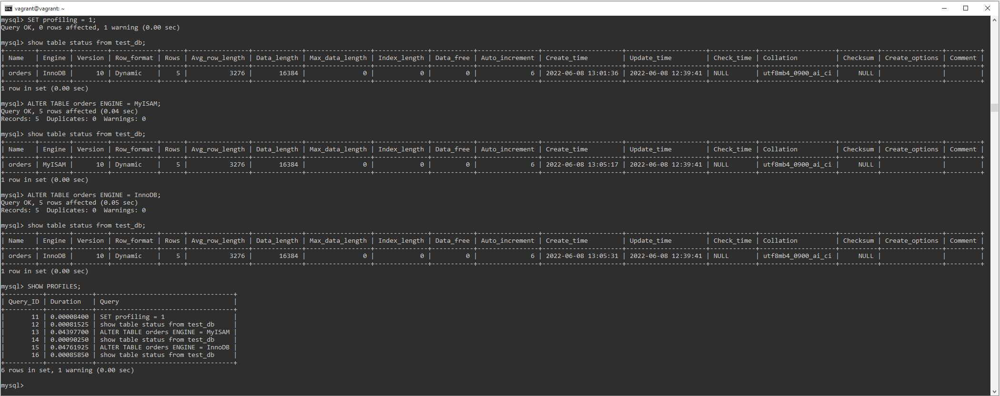
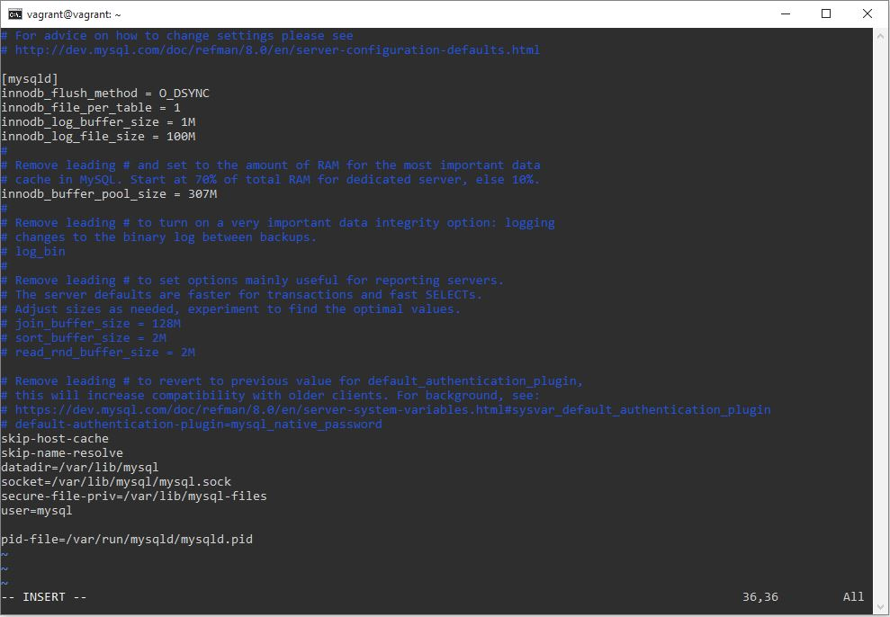

# Домашнее задание к занятию "6.3. MySQL"

## Введение

Перед выполнением задания вы можете ознакомиться с 
[дополнительными материалами](https://github.com/netology-code/virt-homeworks/tree/master/additional/README.md).

## Задача 1

Используя docker поднимите инстанс MySQL (версию 8). Данные БД сохраните в volume.

Изучите [бэкап БД](https://github.com/netology-code/virt-homeworks/tree/master/06-db-03-mysql/test_data) и 
восстановитесь из него.

Перейдите в управляющую консоль `mysql` внутри контейнера.

Используя команду `\h` получите список управляющих команд.

Найдите команду для выдачи статуса БД и **приведите в ответе** из ее вывода версию сервера БД.

Подключитесь к восстановленной БД и получите список таблиц из этой БД.

**Приведите в ответе** количество записей с `price` > 300.

В следующих заданиях мы будем продолжать работу с данным контейнером.

### Ответ
Запускаем контейнер с MySQL сервером, указав в параметрах пароль для root, поддержку русского языка, volume, проброс порта 3306:  
`docker run -d --name 6.3_mysql -e MYSQL_ROOT_PASSWORD=passw -e LANG=C.UTF-8 -v data_volume:/data -p 3306:3306 mysql/mysql-server:8.0`.  
Заходим в управляющую консоль mysql внутри контейнера и создаем пустую БД с названием test_db:  
`docker exec -it 6.3_mysql mysql -uroot -p`, `CREATE DATABASE test_db;`.  
Восстанавливаем БД test_db из бэкапа, скопированного с github в директорию /var/lib/docker/volumes/data_volume/_data:  
`docker exec -it 6.3_mysql bash`, `mysql -u root -ppassw test_db < /data/test_dump.sql`.  
Заходим в управляющую консоль mysql `mysql -uroot -p`, используя команду `\h` находим команду для выдачи статуса БД - `\s`.  
Версия сервера БД из вывода этой команды:
8.0.29 MySQL Community Server - GPL.  
Подключаемся к восстановленной БД и получаем список таблиц из этой БД:
`use test_db`,
`show tables;`.  
Проверяем содержимое имеющейся таблицы: `SELECT * FROM orders;`. Выявляем количество записей с price > 300 с помощью команды:  
`SELECT COUNT(*) FROM orders WHERE price > 300;`, найдена 1 подходящая запись.

## Задача 2

Создайте пользователя test в БД c паролем test-pass, используя:
- плагин авторизации mysql_native_password
- срок истечения пароля - 180 дней 
- количество попыток авторизации - 3 
- максимальное количество запросов в час - 100
- аттрибуты пользователя:
    - Фамилия "Pretty"
    - Имя "James"

Предоставьте привелегии пользователю `test` на операции SELECT базы `test_db`.
    
Используя таблицу INFORMATION_SCHEMA.USER_ATTRIBUTES получите данные по пользователю `test` и 
**приведите в ответе к задаче**.

### Ответ
Создайте пользователя test в БД c паролем test-pass, используя плагин авторизации mysql_native_password, с аттрибутами пользователя Фамилия "Pretty" и Имя "James":  
`CREATE USER 'test'@'%' IDENTIFIED WITH mysql_native_password BY 'test-pass' ATTRIBUTE '{"Фамилия": "Pretty", "Имя": "James"}';`.  
Устанавливаем для созданного пользователя срок истечения пароля - 180 дней, количество попыток авторизации - 3, максимальное количество запросов в час - 100:
`UPDATE mysql.user SET password_lifetime = '180' WHERE User = 'test';`,  
`UPDATE mysql.user SET max_connections = '3' WHERE User = 'test';`,
`UPDATE mysql.user SET max_questions = '100' WHERE User = 'test';`.  
Проверяем параметры с помощью команды:  
`SELECT Host, User, max_connections, max_questions, password_lifetime, User_attributes FROM mysql.user WHERE User = 'test';`.  
Предоставляем привилегии пользователю test на операции SELECT базы test_db:
`GRANT SELECT ON test_db.* TO 'test'@'%';`.
Проверяем с помощью команды: `SHOW GRANTS FOR 'test'@'%';`.  
Используя таблицу INFORMATION_SCHEMA.USER_ATTRIBUTES, получаем данные по пользователю test:  
`SELECT * FROM INFORMATION_SCHEMA.USER_ATTRIBUTES WHERE User = 'test';`

## Задача 3

Установите профилирование `SET profiling = 1`.
Изучите вывод профилирования команд `SHOW PROFILES;`.

Исследуйте, какой `engine` используется в таблице БД `test_db` и **приведите в ответе**.

Измените `engine` и **приведите время выполнения и запрос на изменения из профайлера в ответе**:
- на `MyISAM`
- на `InnoDB`

### Ответ
Устанавливаем профилирование: `SET profiling = 1;`.  
С помощью команды `show table status from test_db;` выявляем, что в таблице БД test_db используется engine InnoDB.  
Изменяем engine, с помощью команды `SHOW PROFILES;` узнаем время выполнения команд:
- на MyISAM - команда `ALTER TABLE orders ENGINE = MyISAM;`, время выполнения - 0.04397700 сек.
- на InnoDB - команда `ALTER TABLE orders ENGINE = InnoDB;`, время выполнения - 0.04761925 сек.

## Задача 4 

Изучите файл `my.cnf` в директории /etc/mysql.

Измените его согласно ТЗ (движок InnoDB):
- Скорость IO важнее сохранности данных
- Нужна компрессия таблиц для экономии места на диске
- Размер буффера с незакомиченными транзакциями 1 Мб
- Буффер кеширования 30% от ОЗУ
- Размер файла логов операций 100 Мб

Приведите в ответе измененный файл `my.cnf`.

### Ответ
Изменяем файл my.cnf согласно ТЗ (движок InnoDB):
- Скорость IO важнее сохранности данных - `innodb_flush_method = O_DSYNC`
- Нужна компрессия таблиц для экономии места на диске - `innodb_file_per_table = 1`
- Размер буффера с незакомиченными транзакциями 1 Мб - `innodb_log_buffer_size = 1M`
- Буффер кеширования 30% от ОЗУ (при условии, что всего 1024 МБ ОЗУ) - `innodb_buffer_pool_size = 307M`
- Размер файла логов операций 100 Мб - `innodb_log_file_size = 100M`

---

### Как оформить ДЗ?

Выполненное домашнее задание пришлите ссылкой на .md-файл в вашем репозитории.

---