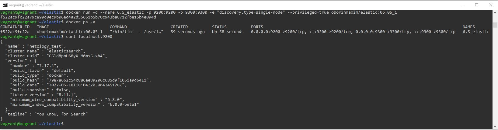
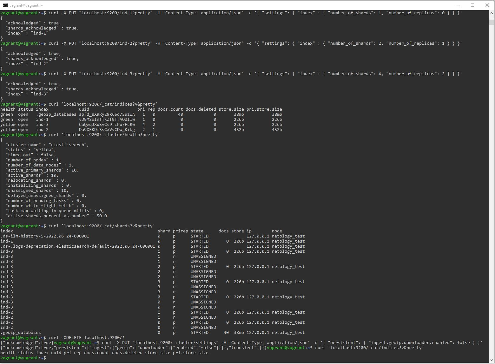
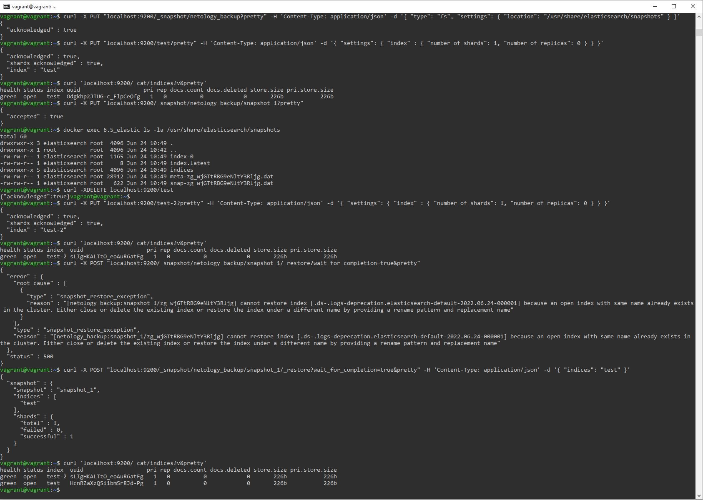

# Домашнее задание к занятию "6.5. Elasticsearch"

## Задача 1

В этом задании вы потренируетесь в:
- установке elasticsearch
- первоначальном конфигурировании elastcisearch
- запуске elasticsearch в docker

Используя докер образ [elasticsearch:7](https://hub.docker.com/_/elasticsearch) как базовый:

- составьте Dockerfile-манифест для elasticsearch
- соберите docker-образ и сделайте `push` в ваш docker.io репозиторий
- запустите контейнер из получившегося образа и выполните запрос пути `/` c хост-машины

Требования к `elasticsearch.yml`:
- данные `path` должны сохраняться в `/var/lib` 
- имя ноды должно быть `netology_test`

В ответе приведите:
- текст Dockerfile манифеста
- ссылку на образ в репозитории dockerhub
- ответ `elasticsearch` на запрос пути `/` в json виде

Подсказки:
- при сетевых проблемах внимательно изучите кластерные и сетевые настройки в elasticsearch.yml
- при некоторых проблемах вам поможет docker директива ulimit
- elasticsearch в логах обычно описывает проблему и пути ее решения
- обратите внимание на настройки безопасности такие как `xpack.security.enabled` 
- если докер образ не запускается и падает с ошибкой 137 в этом случае может помочь настройка `-e ES_HEAP_SIZE`
- при настройке `path` возможно потребуется настройка прав доступа на директорию

Далее мы будем работать с данным экземпляром elasticsearch.

### Ответ
Текст Dockerfile манифеста:
```
FROM elasticsearch:7.17.4
RUN mkdir /var/lib/elastic.data && chmod -R 777 /var/lib/elastic.data
COPY elasticsearch.yml /usr/share/elasticsearch/config/elasticsearch.yml
EXPOSE 9200
EXPOSE 9300
```
Собираем docker-образ и делаем push в docker.io репозиторий:  
`docker build -t oborinmaxim/elastic:06.05_1 .`,  
`docker login -u oborinmaxim`,  
`docker push oborinmaxim/elastic:06.05_1`.  
Ссылка на образ в репозитории dockerhub: https://hub.docker.com/r/oborinmaxim/elastic.  
Команда для запуска контейнера:  
`docker run -d --name 6.5_elastic -p 9200:9200 -p 9300:9300 -e "discovery.type=single-node" --privileged=true oborinmaxim/elastic:06.05_1`.  
Ответ elasticsearch на запрос `curl localhost:9200` в json виде на скриншоте:



## Задача 2

В этом задании вы научитесь:
- создавать и удалять индексы
- изучать состояние кластера
- обосновывать причину деградации доступности данных

Ознакомтесь с [документацией](https://www.elastic.co/guide/en/elasticsearch/reference/current/indices-create-index.html) 
и добавьте в `elasticsearch` 3 индекса, в соответствии со таблицей:

| Имя | Количество реплик | Количество шард |
|-----|-------------------|-----------------|
| ind-1| 0 | 1 |
| ind-2 | 1 | 2 |
| ind-3 | 2 | 4 |

Получите список индексов и их статусов, используя API и **приведите в ответе** на задание.

Получите состояние кластера `elasticsearch`, используя API.

Как вы думаете, почему часть индексов и кластер находится в состоянии yellow?

Удалите все индексы.

**Важно**

При проектировании кластера elasticsearch нужно корректно рассчитывать количество реплик и шард,
иначе возможна потеря данных индексов, вплоть до полной, при деградации системы.

### Ответ
Добавляем в elasticsearch 3 индекса, в соответствии с таблицей:  
`curl -X PUT "localhost:9200/ind-1?pretty" -H 'Content-Type: application/json' -d '{ "settings": { "index" : { "number_of_shards": 1, "number_of_replicas": 0 } } }'`,  
`curl -X PUT "localhost:9200/ind-2?pretty" -H 'Content-Type: application/json' -d '{ "settings": { "index" : { "number_of_shards": 2, "number_of_replicas": 1 } } }'`,  
`curl -X PUT "localhost:9200/ind-3?pretty" -H 'Content-Type: application/json' -d '{ "settings": { "index" : { "number_of_shards": 4, "number_of_replicas": 2 } } }'`.  
Получаем список индексов и их статусов, используя API:
`curl 'localhost:9200/_cat/indices?v&pretty'`.  
Получаем состояние кластера elasticsearch, используя API:
`curl 'localhost:9200/_cluster/health?pretty'`.  
Часть индексов и кластер находится в состоянии yellow из-за того, что реплики находятся в состоянии unassigned (т.е. не привязаны ни к одной из нод). Подробнее о состоянии шард - по запросу метода _cat/shards: `curl 'localhost:9200/_cat/shards?v&pretty'`.  
Удаляем все индексы:
`curl -XDELETE localhost:9200/*`.  
Изменяем настройки кластера с помощью API, чтобы удалить системный индекс .geoip_databases, и проверяем, что список индексов пуст:  
`curl -X PUT "localhost:9200/_cluster/settings" -H 'Content-Type: application/json' -d '{ "persistent": { "ingest.geoip.downloader.enabled": false } }'`,  
`curl 'localhost:9200/_cat/indices?v&pretty'`.



## Задача 3

В данном задании вы научитесь:
- создавать бэкапы данных
- восстанавливать индексы из бэкапов

Создайте директорию `{путь до корневой директории с elasticsearch в образе}/snapshots`.

Используя API [зарегистрируйте](https://www.elastic.co/guide/en/elasticsearch/reference/current/snapshots-register-repository.html#snapshots-register-repository) 
данную директорию как `snapshot repository` c именем `netology_backup`.

**Приведите в ответе** запрос API и результат вызова API для создания репозитория.

Создайте индекс `test` с 0 реплик и 1 шардом и **приведите в ответе** список индексов.

[Создайте `snapshot`](https://www.elastic.co/guide/en/elasticsearch/reference/current/snapshots-take-snapshot.html) 
состояния кластера `elasticsearch`.

**Приведите в ответе** список файлов в директории со `snapshot`ами.

Удалите индекс `test` и создайте индекс `test-2`. **Приведите в ответе** список индексов.

[Восстановите](https://www.elastic.co/guide/en/elasticsearch/reference/current/snapshots-restore-snapshot.html) состояние
кластера `elasticsearch` из `snapshot`, созданного ранее. 

**Приведите в ответе** запрос к API восстановления и итоговый список индексов.

Подсказки:
- возможно вам понадобится доработать `elasticsearch.yml` в части директивы `path.repo` и перезапустить `elasticsearch`

### Ответ
Создаем директорию {путь до корневой директории с elasticsearch в образе}/snapshots: `docker exec -it 6.5_elastic bash`, `mkdir snapshots`.  
Добавляем в elasticsearch.yml строку: `path.repo: /usr/share/elasticsearch/snapshots`. Перезапускаем контейнер: `docker restart 6.5_elastic`.  
Используя API, регистрируем директорию snapshots как snapshot repository c именем netology_backup:  
`curl -X PUT "localhost:9200/_snapshot/netology_backup?pretty" -H 'Content-Type: application/json' -d '{ "type": "fs", "settings": { "location": "/usr/share/elasticsearch/snapshots" } }'`.  
Создаем индекс test с 0 реплик и 1 шардом и приводим список индексов:  
`curl -X PUT "localhost:9200/test?pretty" -H 'Content-Type: application/json' -d '{ "settings": { "index" : { "number_of_shards": 1, "number_of_replicas": 0 } } }'`,  
`curl 'localhost:9200/_cat/indices?v&pretty'`.  
Создаем snapshot состояния кластера elasticsearch:  
`curl -X PUT "localhost:9200/_snapshot/netology_backup/snapshot_1?pretty"`.  
Приводим список файлов в директории со snapshotами:  
`docker exec 6.5_elastic ls -la /usr/share/elasticsearch/snapshots`.  
Удаляем индекс test и создаем индекс test-2, приводим список индексов:  
`curl -XDELETE localhost:9200/test`,  
`curl -X PUT "localhost:9200/test-2?pretty" -H 'Content-Type: application/json' -d '{ "settings": { "index" : { "number_of_shards": 1, "number_of_replicas": 0 } } }'`,  
`curl 'localhost:9200/_cat/indices?v&pretty'`.  
Запрос восстановления всего кластера elasticsearch из snapshot, созданного ранее, вызывает ошибку, связанную с имеющимися системными индексами .ds-.logs-... и .ds-ilm-...:  
`curl -X POST "localhost:9200/_snapshot/netology_backup/snapshot_1/_restore?wait_for_completion=true&pretty"`.  
Поэтому восстанавливаем индекс test, приводим итоговый список индексов:  
`curl -X POST "localhost:9200/_snapshot/netology_backup/snapshot_1/_restore?wait_for_completion=true&pretty" -H 'Content-Type: application/json' -d '{ "indices": "test" }'`,  
`curl 'localhost:9200/_cat/indices?v&pretty'`.



---

### Как cдавать задание

Выполненное домашнее задание пришлите ссылкой на .md-файл в вашем репозитории.

---