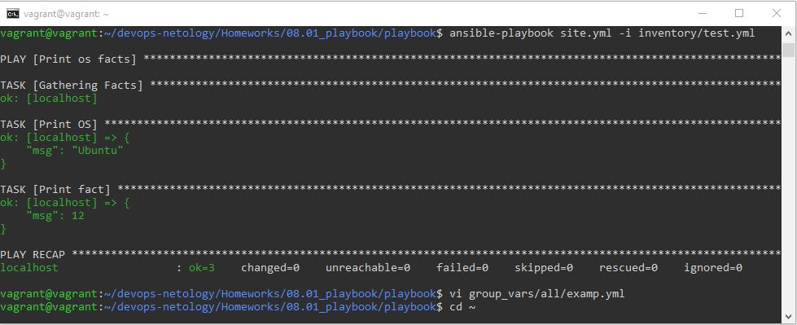
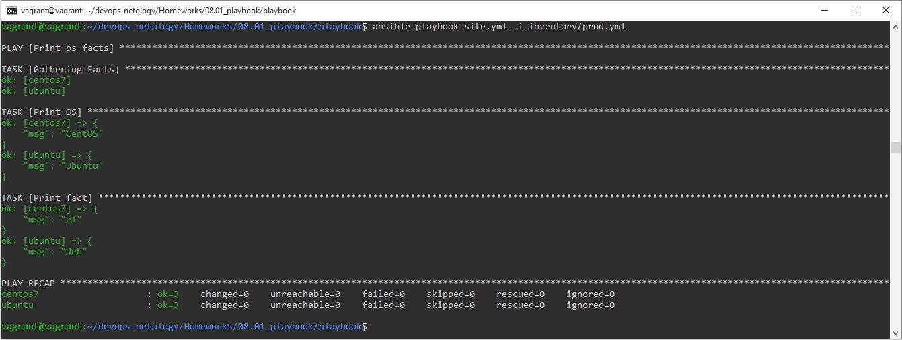
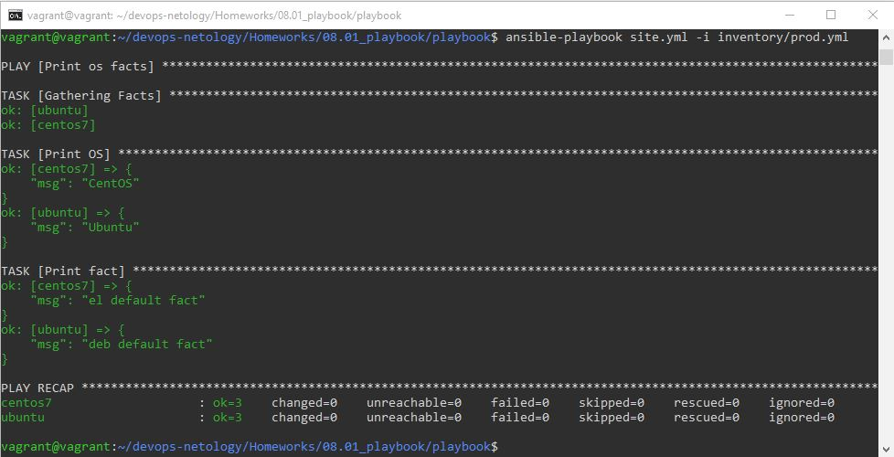
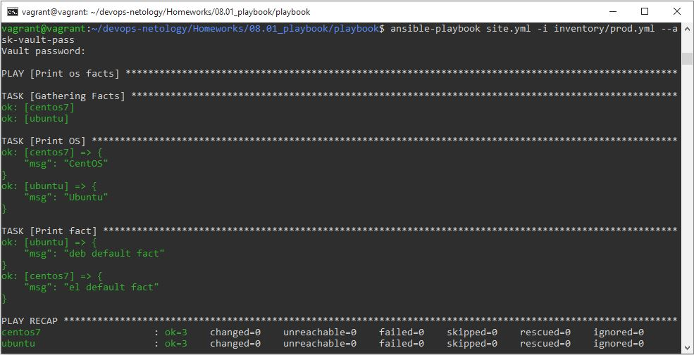
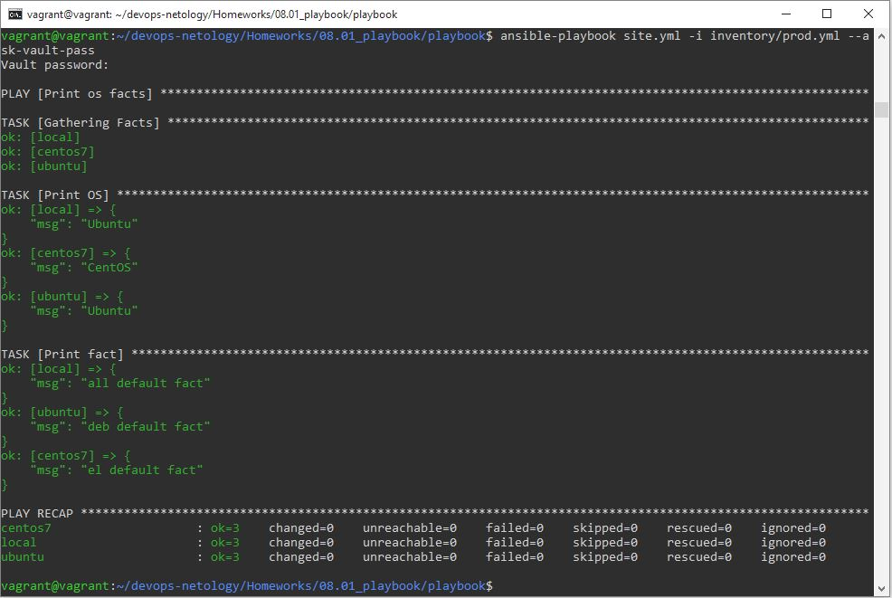
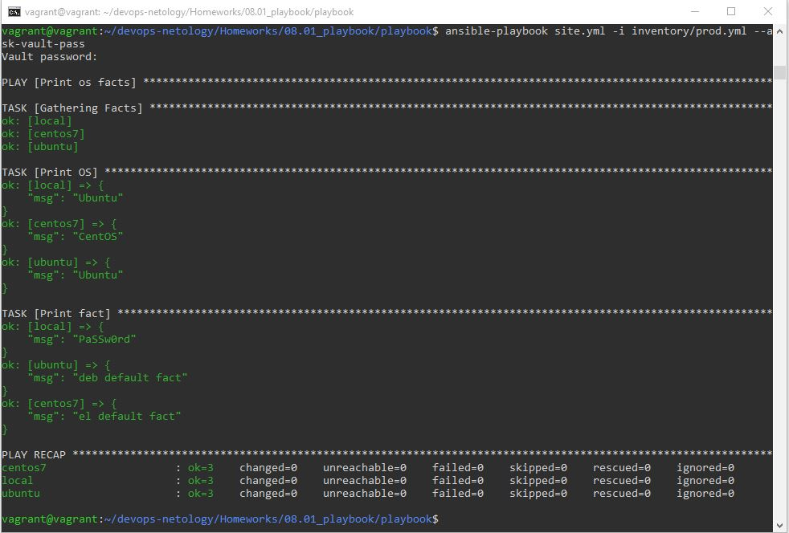
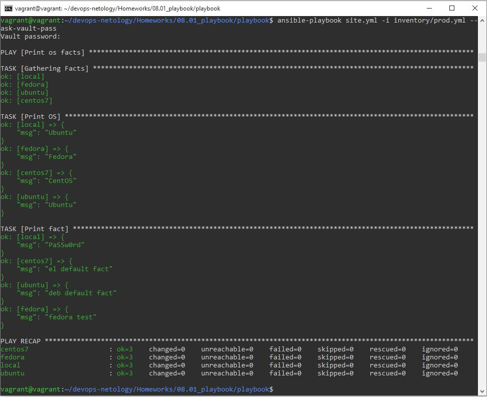
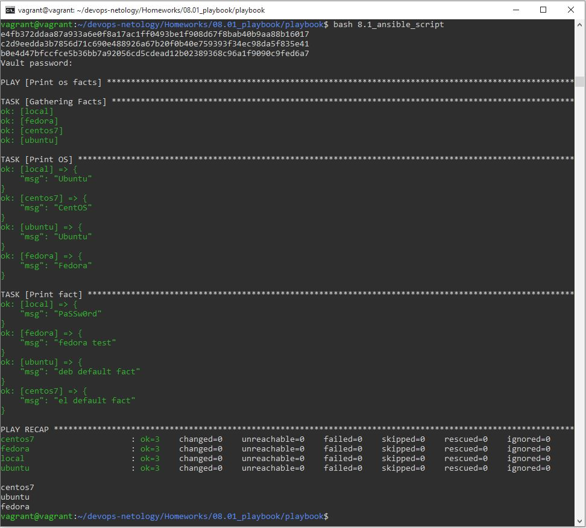

# Домашнее задание к занятию "08.01 Введение в Ansible"

## Подготовка к выполнению
1. Установите ansible версии 2.10 или выше.
2. Создайте свой собственный публичный репозиторий на github с произвольным именем.
3. Скачайте [playbook](./playbook/) из репозитория с домашним заданием и перенесите его в свой репозиторий.

## Основная часть
1. Попробуйте запустить playbook на окружении из `test.yml`, зафиксируйте какое значение имеет факт `some_fact` для указанного хоста при выполнении playbook'a.  

Команда для запуска: `ansible-playbook site.yml -i inventory/test.yml`. `some_fact` имеет значение `12`.

2. Найдите файл с переменными (group_vars) в котором задаётся найденное в первом пункте значение и поменяйте его на 'all default fact'.  

Вносим изменения в файл group_vars/all/examp.yml.
3. Воспользуйтесь подготовленным (используется `docker`) или создайте собственное окружение для проведения дальнейших испытаний.  

```
docker pull centos:7
docker run --rm --name centos7 -d centos:7 ping -i 30 127.0.0.1
docker pull ubuntu
docker run --rm --name ubuntu -d oborinmaxim/ubuntu_python sleep 10h
```
4. Проведите запуск playbook на окружении из `prod.yml`. Зафиксируйте полученные значения `some_fact` для каждого из `managed host`.  

Команда для запуска: `ansible-playbook site.yml -i inventory/prod.yml`. `some_fact` имеет значения: для centos7 `el`, для ubuntu `deb`.

5. Добавьте факты в `group_vars` каждой из групп хостов так, чтобы для `some_fact` получились следующие значения: для `deb` - 'deb default fact', для `el` - 'el default fact'.  

Вносим изменения в файлы group_vars/deb/examp.yml и group_vars/el/examp.yml.
6. Повторите запуск playbook на окружении `prod.yml`. Убедитесь, что выдаются корректные значения для всех хостов.  

Команда для запуска: `ansible-playbook site.yml -i inventory/prod.yml`.

7. При помощи `ansible-vault` зашифруйте факты в `group_vars/deb` и `group_vars/el` с паролем `netology`.  

Команды: `ansible-vault encrypt group_vars/deb/examp.yml`, `ansible-vault encrypt group_vars/el/examp.yml`.
8. Запустите playbook на окружении `prod.yml`. При запуске `ansible` должен запросить у вас пароль. Убедитесь в работоспособности.  

Команда для запуска: `ansible-playbook site.yml -i inventory/prod.yml --ask-vault-pass`.

9. Посмотрите при помощи `ansible-doc` список плагинов для подключения. Выберите подходящий для работы на `control node`.  

Команда для поиска: `ansible-doc -t connection -l`. Подходящий плагин - local.
10. В `prod.yml` добавьте новую группу хостов с именем  `local`, в ней разместите localhost с необходимым типом подключения.  

Вносим изменения в файл inventory/prod.yml.
11. Запустите playbook на окружении `prod.yml`. При запуске `ansible` должен запросить у вас пароль. Убедитесь что факты `some_fact` для каждого из хостов определены из верных `group_vars`.  

Команда для запуска: `ansible-playbook site.yml -i inventory/prod.yml --ask-vault-pass`.

12. Заполните `README.md` ответами на вопросы. Сделайте `git push` в ветку `master`. В ответе отправьте ссылку на ваш открытый репозиторий с изменённым `playbook` и заполненным `README.md`.

## Необязательная часть

1. При помощи `ansible-vault` расшифруйте все зашифрованные файлы с переменными.  

Команды: `ansible-vault decrypt group_vars/deb/examp.yml`, `ansible-vault decrypt group_vars/el/examp.yml`.
2. Зашифруйте отдельное значение `PaSSw0rd` для переменной `some_fact` паролем `netology`. Добавьте полученное значение в `group_vars/all/exmp.yml`.  

Команда: `ansible-vault encrypt group_vars/all/exmp.yml`.
3. Запустите `playbook`, убедитесь, что для нужных хостов применился новый `fact`.  

Команда для запуска: `ansible-playbook site.yml -i inventory/prod.yml --ask-vault-pass`.

4. Добавьте новую группу хостов `fedora`, самостоятельно придумайте для неё переменную. В качестве образа можно использовать [этот](https://hub.docker.com/r/pycontribs/fedora).  

Добавляем группу хостов в файл inventory/prod.yml, добавляем для нее переменную в файле group_vars/test/examp.yml.
```
docker pull pycontribs/fedora
docker run --rm --name fedora -d pycontribs/fedora sleep 10h
```

5. Напишите скрипт на bash: автоматизируйте поднятие необходимых контейнеров, запуск ansible-playbook и остановку контейнеров.  

Создаем скрипт: `sudo touch /usr/bin/8.1_ansible_script`, `sudo chmod 777 /usr/bin/8.1_ansible_script`, `vi /usr/bin/8.1_ansible_script`. Содержимое скрипта:
```
#!/bin/bash
docker run --rm --name centos7 -d centos:7 ping -i 30 127.0.0.1
docker run --rm --name ubuntu -d oborinmaxim/ubuntu_python sleep 10h
docker run --rm --name fedora -d pycontribs/fedora sleep 10
ansible-playbook /home/vagrant/devops-netology/Homeworks/08.01_playbook/playbook/site.yml -i /home/vagrant/devops-netology/Homeworks/08.01_playbook/playbook/inventory/prod.yml --ask-vault-pass
docker stop centos7
docker stop ubuntu
docker stop fedora
```
Результат отработки скрипта:


6. Все изменения должны быть зафиксированы и отправлены в вашей личный репозиторий.

---

### Как оформить ДЗ?

Выполненное домашнее задание пришлите ссылкой на .md-файл в вашем репозитории.

---